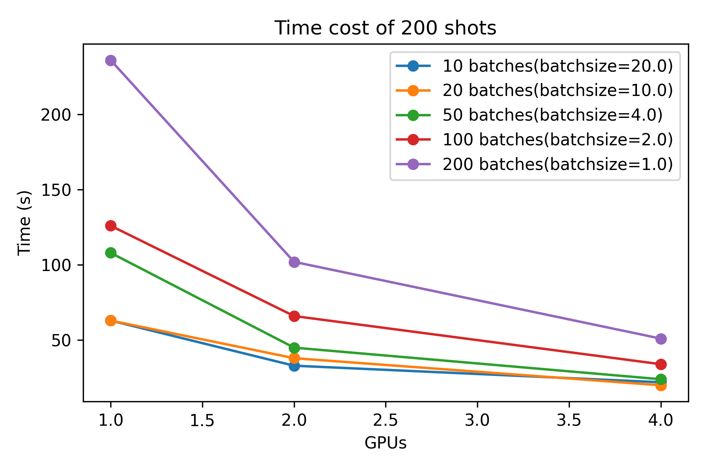

# Advanced Customization

In Seistorch, advanced users have the flexibility to define and implement their custom wave equations and loss functions. This level of customization allows you to tailor Seistorch to specific research objectives and experiment with novel algorithms. This chapter will guide you through the process of creating your own wave equation and loss function.

## Writing Your Custom Wave Equation

### Step 1: Define the Wave Equation

- **Objective**: Clearly define the mathematical form of your custom wave equation, including the physical parameters, equations, and boundary conditions.
1. **Define the needed parameters and names of wavefields**: Added a new line in the class `Parameters` of `seistorch/eqconfigure.py` to configure your paramters.

    ```python
    # seistorch/eqconfigure.py
    class Parameters:
        """ 
        Specify which model parameters are required by a given equation. 
        """
        @staticmethod
        def valid_model_paras():

            paras = {
                "my_wave_equation": ["c"]
            }

            return paras


    class Wavefield:
        """ 
        Specify which wavefield variables are required by a given equation. 
        """
        def __init__(self, equation="acoustic"):
            self.wavefields = getattr(self, equation)

        @property
        def my_wave_equation(self,):
            return ["wavefield1", "wavefield2"]

    ```

    The available `source_type` and `receiver_type` options will indeed correspond to the variable names defined within your `Wavefield` class.
    
    Example:
    ```yaml
    geom:

        source_type: 
        - wavefield1

        receiver_type:
        - wavefield2
    ```

2. **Define the Forward Timestep Function**: Create a Python function named `_time_step` that adheres to the Seistorch solver interface and save it as `my_wave_equation.py` in `seistorch/equations`. You can set the parameter `equation` in configure file to `my_wave_equation` to call it.

    Example:
    ```python 
    # my_wave_equation.py
    def _time_step(*args):
        c = args[0] # vp
        wavefield1, wavefield2 = args[1:3] # wavefield variables
        dt, h, b = args[3:6] # dt: time sampling interval, h: grid size, b: boundary coefficients of PML
        # b = 0
        # When b=0, without boundary conditon.
        y = wave_equation_forward_in_time(wavefield1, wavefield2, c, dt, h, b)
        return y, wavefield1
    ```

    The `_time_step` function returns all the wavefield variables. In the scalar acoustic wave equation, the calculation typically involves using the wavefield values at time step `t` and time step `t-1`to compute the wavefield at time step `t+1`. The variables `y` and `wavefield1` here represent the wavefield values at time step `t+1` and time step `t`, respectively. These values are used to recursively compute the wavefield at each time step, and they are passed to the next iteration for the time-stepping.

3. **Define the Backward Timestep Function**: This step is optional. If you want to use boundary saving to save computational resources, please follow this step.

    **Note**: If you have sufficient computational resources, you can choose to only implement the `_time_step` function and set `boundary_saving` to `false` during inversion. This way, Pytorch will construct the computational graph automatically using the `_time_step` function in the forward modeling process.

    When performing fwi and the `boundary_saving` is set to `true`. Seistorch will save the necessary boundary values automatically during the forward modeling in the context of `torch.no_grad()`.

    In the `_time_step_backward`, we will calculate the wavefields in reverse time. Assigning boundary values and reloading the source is essential for reconstructing the wavefield. The `_time_step_backward` is called in the context of `torch.enable_grad()`.


    Example:
    ```python
    # acoustic.py
    def _time_step_backward(*args):

        vp = args[0]
        wavefield1, wavefield2 = args[1:3]
        dt, h, b = args[3:6]
        boundary_values, _ = args[-2]
        src_type, src_func, src_values = args[-1]

        vp = vp.unsqueeze(0)
        b = b.unsqueeze(0)

        # b = 0

        # Calculate the wavefield at t-1
        y = wave_equation_reverse_in_time(wavefield1, wavefield2, c, dt, h, b)

        # Assign the boundary values
        y = restore_boundaries(y, boundary_values)

        # Add the source
        y = src_func(y, src_values, 1)

        return y, h1
    ```

## Writing Your Custom Loss function

In Seistorch, adding a new objective function is typically easier than creating a wave equation solver. All objective functions should be implemented and placed in the `seistorch/loss.py` file. This way, you can easily access the new objective function by using a command like `--loss vp=myloss`" during the execution.

Example:

```python

class MyLoss1(torch.nn.Module):
    def __init__(self, ):
        super(MyLoss1, self).__init__()

    @property
    def name(self,):
        return "myloss1"
    
    def forward(self, syn, obs):
        ctx.save_for_backward(syn, obs)
        return torch.nn.MSELoss()(syn, obs)

    def backward(self, grad_output):
        syn, obs = ctx.saved_tensors
        adj = 2*(syn-obs)*grad_output
        return adj, None

class MyLoss2(torch.nn.Module):
    def __init__(self, ):
        super(MyLoss2, self).__init__()

    @property
    def name(self,):
        return "myloss2"
    
    def forward(self, syn, obs):
        return torch.nn.MSELoss()(syn, obs)
```

In the functions mentioned above, you've defined two classes, `MyLoss1` and `MyLoss2`, both of which inherit from torch.nn.Module. They each have a property attribute called `name`, and you can call the respective loss functions by accessing their `name` property.

However, it's interesting to note that although you've defined a custom backward method in `MyLoss1`, when calculating gradients, the results are identical between the two loss functions. You can modify this code to implement your own custom backward method.


## How to choose the value of `num-batches`?

The parameter `num-batches` determines how many shots are grouped together for calculation. If `num-batches` is set too low, it can decrease computational efficiency, while if it's set too high, it may lead to out-of-memory (OOM) errors due to excessive GPU memory usage. We conducted several test runs for your reference.

We employed a layered model with a size of `nz*nx=128*1024`for forward modeling to test the computational efficiency under various conditions, including different batch sizes, node counts, and GPU numbers.

The following figure summarizes the efficiency. (CPU:  Intel(R) Xeon(R) Silver 4214R CPU @ 2.40GHz; GPU: Tesla V100S-PCIE-32GB)



**Note**: When we had 4 GPUs, we utilized two nodes, each equipped with 2 GPU cards.

