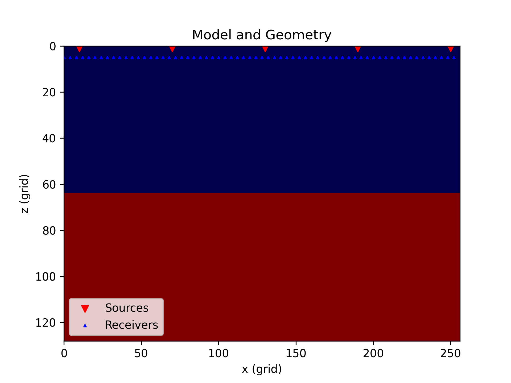

# Forward modeling

Seistorch now using `mpi4py` library for performing forward modeling (# WILL BE DEPRECATED, USING TORCHRUN INSTEAD). The following files are needed for forward modeling:

- host file

    The host file is used to specify the nodes and gpus u wanna use. It has following format:
    ```shell
    ip address:number of processes
    # The number of processes must be <= gpu device counts
    ```
    Example:
    ```shell
    192.168.0.1:5
    192.168.0.2:4
    192.168.0.2:4
    ```
    For the example case, 4 gpu cards per node is used, the reason why the value of the first node reads 5 is that a extra rank is needed for task assignment.

- source and receiver files (in pkl format)

    Please refer to [**Data format**](data_format.md).


- configure file (in yml format)

    Please refer to example configure files in `examples/forward_modeling/different_eq/configs/*.yml`

- executable file

    An executable `forward.sh` file looks like:
    ```forward.sh
    mpirun -f hosts \
    python fwi.py configure.yml \
    --mode forward \
    --num-batches 1 \
    --use-cuda
    ```

# 2d forward modeling in acoustic case

The code of this section locates at `examples/forward_modeling/forward_modeling2d`. This example shows how to run forward modeling with your own model and geometry.

-   First we need to change the directory into it.

    ```shell
    cd examples/forward_modeling
    ```

-   Generate a two layer model and the corresponding sources-receivers pairs by typing:

    ```shell
    python generate_model_geometry.py
    ```

    Two new folders **geometry** and **velocity_model** will be created. The figure **model_geometry.png** illustrates the generated layer model and the locations of source-receiver pairs.

    

-   Running the shell script `forward.sh`, a file called `shot_gather.npy` will be created.

    ```shell
    sh forward.sh
    ```

-   Show the shot gathers.

    ```shell
    python show_shotgather.py
    ```

    The plotted results will be save in **shot_gather.png** (shown as follows).
    
    


# 2d forward modeling in elastic case

The code of this section locates at `examples/forward_modeling/elastic_modeling2d`. This example shows how to run forward modeling using elastic wave equation.

-   Step1: Generate a two layer model and the corresponding sources-receivers pairs by typing:

    ```shell
    python generate_model_geometry.py
    ```

    Two new folders **geometry** and **velocity_model** will be created. The figure **model_geometry.png** illustrates the generated layer model and the locations of source-receiver pairs.

    

-   Step2: Running the shell script `forward.sh`, a file called `shot_gather.npy` will be created.

    ```shell
    sh forward.sh
    ```
-   Step3: Show the shot gathers.

    ```shell
    python show_shotgather.py
    ```

    The plotted results will be save in **shot_gather.png** (shown as follows).
    
    


# 3d forward modeling in acoustic case

The code of this section locates at `examples/forward_modeling/forward_modeling3d`. This example shows how to run forward modeling with your own model and geometry.

- **Generate geometry and velocity model**

    The script `generate_model_geometry.py` generates a 3D velocity model with two layers. A ricker source at the center of the model suface is used for modeling. Moreover, we have created a three-dimensional observational system, and a schematic diagram of this observational system will be generated after running this script.

    ```shell
    python generate_model_geometry.py
    ```

    

- **Run forward modeling**

    Perform simulation by running script `forward.sh`.

    ```shell
    sh forward.sh
    ```

- **Show results**

    The modeled data has 1 shot with 2000 time samples, 128 traces and a single component (displacement in scalar wave equation). The first 64 and last 64 traces are recorded along different line directions. Run the script will show the recorded data.

    ```shell
    python show_shotgather.py
    ```
    


If you wanna generate your own 3D geometry and 3D velocity model, please refer to the section [data format](data_format.md).