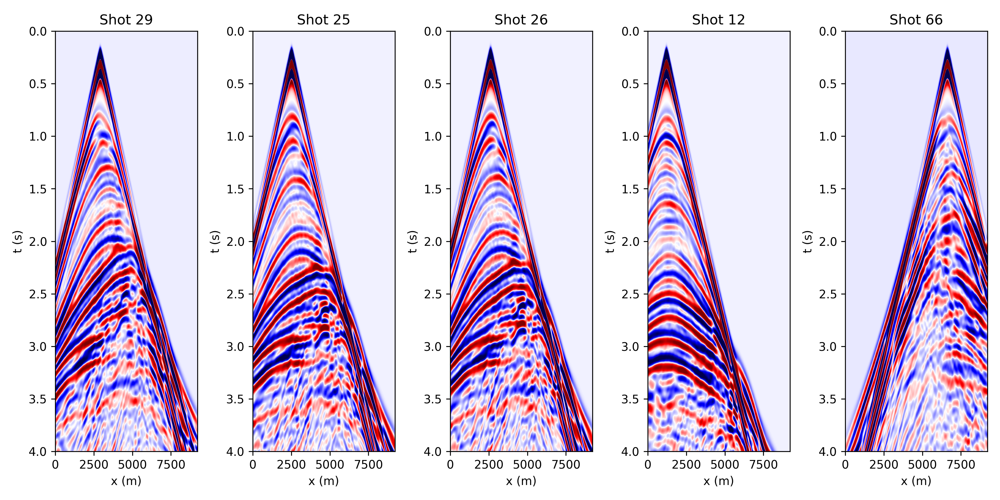
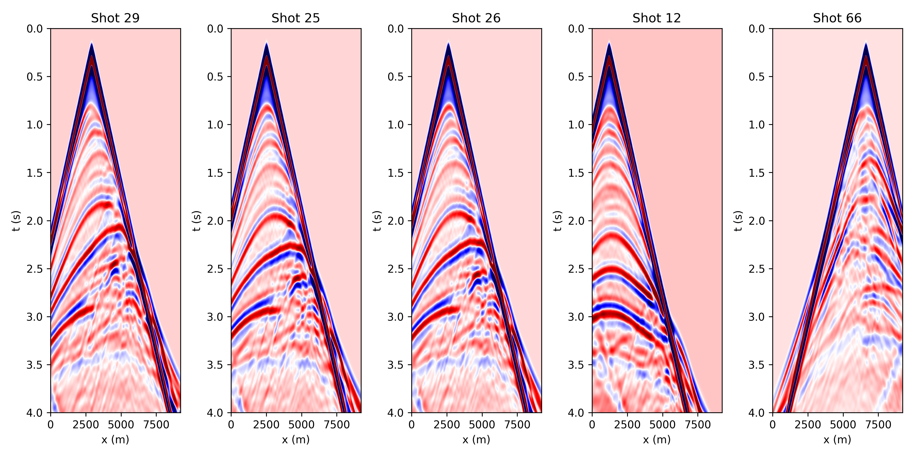
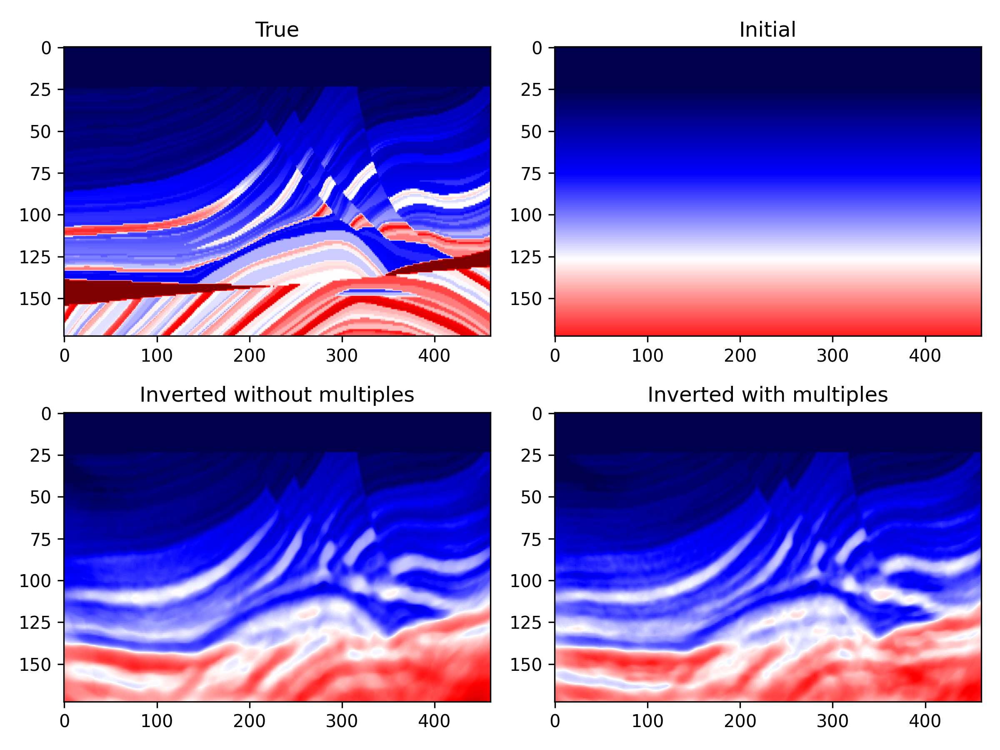

# Boundary saving-based automatic differentiation

The code of this section locates at `examples/check_features/ADvsBS`. This exmaples shows a workflow of performing full waveform inversion based on pure automatic differentiation (PAD) and boundary saving-based automatic differentiation (BSAD). The BSAD method is used to reduce the GPU memory usage by reconstructing the wavefield with boundary saving strategy during loss backpropagation.

- **Generate model and geometry**

    ```shell
    python generate_model_geometry.py
    ```

    The srcipt `generate_model_geometry.py` will generate a 2 layer ground truth model and a smoothed version of it. The corresponding source-receiver pairs will be generated as well. A figure named **model_geometry.png** illustrate the true and initial model.

    

- **Generate observed data**

    The configure file of forward modeling lies in `configs/forward.yml`

    ```shell
    sh forward.sh
    ```

    The script `forward.sh` will genereate the observed data **shot_gather.npy** for inversion.

- **Perform PAD FWI and BSAD FWI**

    Set `boundary_saving: true` can reduce GPU memory usage.

    Perform full waveform inversion with pure automatic differeniation.

    ```shell
    sh inversion_AD.sh
    ```

    Perform full waveform inversion with boundary-saving automatic differeniation.

    ```shell
    sh inversion_BS.sh
    ```

    The configure files can be found in `acoustic_fwi/configs/inversion_AD.yml` and `acoustic_fwi/configs/inversion_BS.yml`.

    Compare the results between the two methods.

    ```shell
    python AD_vs_BS.py
    ```

    The BSAD method significantly reduces memory usage and sacrifices some computational efficiency. The gradients of the AD and BS methods are shown in the following figures.

    

# 2D Source Encoding Acoustic FWI

This chapter primarily focuses on how to perform Seistorch's Source Encoding Full Waveform Inversion (FWI) using the same parameter file as Classic FWI. The difference lies in the utilization of `codingfwi.py` to perform the FWI process with source encoding. The files of this example are in folder `examples/inversion/source_encoding/acoustic`.

- **Generate the acquisition**
    First you need to run the script the `generate_model_geometry.py`. Just like the other examples, it will generate `sources.pkl` and `receivers.pkl` which describes the acquisition of modeling.

    ```shell
    python generate_model_geometry.py
    ```

    

- **Running forward modeling**

    Run the script `forward.sh` to generate the observed data.

    ```shell
    sh forward.sh
    ```
    

- **Running inversion**

    The same configure file `forward.yml` is used for both forward modeling and inversion. The arguments of source encoding can be found in `source_encoding_fwi.sh`. The meaning of the arguments of `codingfwi.py` can be found in [running commands](running_commands.md).

    ```shell
    sh source_encoding_fwi.sh
    ```

- **Show inverted results**

    The script `show_results.py` can be used to show the inverted results when the `source_encoding_fwi.sh` has been executed done.

    ```shell
    python show_results.py
    ```

    

# 2D Source Encoding Elastic FWI

In elastic wave-equation based fwi, three model parameters are need for calculating lame parameters, i.e. ***vp***, ***vs*** and ***rho***. In this example, the ***rho*** is set to constant 2000. And the ratio between ***vp*** and ***vs*** is also a constant 1.73 except for the regions of sea with a depth of 500m. We only invert ***vp*** and ***vs*** in this example. The files of this example are in folder `examples/inversion/source_encoding/elastic`.

Files of true models all begin with `true_`, while initial models are prefixed with `linear_`. They are all placed in `examples/models/marmousi_model`.

- **Generate the acquisition**

    As with other examples, we need to first generate observed data. So we need a acquisition system. The script `generate_mode_geometry.py` can help you to do this. 

    We loaded the source at wavefield `vz` , which can be found in `forward.yml`. If you want to load the source to several wavefields, please refer to the section [data format](configure.md#restricted-choice-parameter).

    We record the velocity components `vx` and `vz` and use them for inversion.

    The generated acquisition system is shown in the following figure.
    

- **Running forward modeling**

    Type the following commands in your conda environment, the observed data will be generated.

    ```shell
    sh forward.sh
    ```
    
    The generated data has a shape (nshots, nsamples, ntraces, ncomponents)(refer to [data format](data_format.md#shot-gather)). The following figure shows some randomly selected shots from `vz`.

    


- **Running inversion**

    The same configure file `forward.yml` is used for both forward modeling and inversion. The arguments of this example can be found in `source_encoding_fwi.sh`. You can assign different loss functions (if they have been implemented in seistorch/loss.py) and learning rates to different parameters.

    ```shell
    sh source_encoding_fwi.sh
    ```

- **Show inverted results**

    The script `show_results.py` can be used to show the inverted results when the `source_encoding_fwi.sh` has been executed done.

    ```shell
    python show_results.py
    ```

    


# Batched & Distributed FWI

**WARNING: Please make sure there are more than 1 GPU on your machine for running this example successfully. (At least 2 GPU for this example)**

In classic FWI codes, the computation of seismic data for each shot is typically done in a serial or MPI-parallel manner, meaning each shot is computed individually. However, deep learning frameworks provide us with batch computation capabilities through APIs like `conv2d` and `conv3d`. This allows us to simultaneously compute multiple shots, improving computational efficiency.

In Seistorch, both forward modeling and inversion provide batched computation (BC) functionality, but with different parameters. The BC is only valid for classic fwi, whose gradient are accumulated by multiples shots, while source-encoding-based fwi encoded several sources into a super-source so the gradient is calculated with only a super but single shot.

When running `fwi.py` for **forward modeling** you can specify the number of batches into which all the shots will be distributed by setting the `num-batches` parameter. This allows you to control how the shots are grouped for processing. More details can be seen in [Running commands](running_commands.md).

The source code of this section locates at `examples/check_features/torchrun_dist`. Please follow the following steps.

- **Generate geometry**

    The acquisition of this examples consists of 87 sources and 128 receivers in each shot.

    ```shell
    python generate_model_geometry.py
    ```

    

- **Modeling observed data in a batched manner**

    In the `forward.sh`, we set `--num-batches 10`, it means that all shots will be separated into `10` bathches for modeling. Since we need to calculate `87` shots and use 2 GPUs (the host file is set as: `127.0.0.1:3`), except for the last batch, which has a batch size of `7`, the batch size for all other batches is `8`.
    
    Besides, all batches will be distributed to 2 GPUs equally. That is to say, GPU1 will run 1~5 batches and GPU2 will run the other 6~10 batches.

- **Perform classic fwi**

    For performing classic fwi, you need to set the `minibatch` in `configure.yml` to `true`, and set a proper `batch_size` which is `20` in our case. The number `20` represents the total shots used in one epoch for calculating the gradients. In this example, we use two GPU for fwi, so the `nproc_per_node` in `inversion.sh` need be set to 2.

    ```
    batch_size: The number of shots used for gradient calculation in a single epoch.
    The number of shots that each GPU need to perform = batch_size // nproc_per_node
    The number of shots that each GPU need to perform at each step = batch_size // nproc_per_node // step_per_epoch
    ```

    In the `inversion.sh` script, we specify `step-per-epoch` as `1`, which bundles ten shots into a single batch for gradient computation on each GPU. This process is equivalent to separately computing the gradients for 10 shots and then summing them together.

    If your model is too large, the number of shots in a single batch may be too large to fit into the GPU memory. There are two ways to solve this problem. One is to reduce the `batch_size` in `configure.yml`, and the other is to increase the `step-per-epoch` in `inversion.sh`. For the latter, the gradient will be accumulated for multiple batches, which will reduce the memory usage.

    ```shell
    sh inversion.sh
    ```

- **Show the inverted results**

    The inverted resutls will be saved at `./results`. The following figure shows the final inverted result.

    


# Towed streamer data generation and inversion

In this chapter, we provide an example to illustrate the generation and inversion of towed streamer data. The source codes are in `examples/inversion/towed/towed_2d`.

In the seistorch, the sources and receivers are stored in a nested python list object (please refer to [data format section](#data_format.md)). It's flexiable for users to set a different number of receivers for different shots. 

**Note**: It's only necessary to ensure that the number of source points is the same as the number of receiver arrays; there's no requirement for each receiver array to have the same quantity of receivers.

- **Model and acquisition setting**

    The script `generate_model_geometry.py` provides a workflow to generate a towed acquisition. We need to make sure that all the coordinates of sources and receivers are both within the model grids.

    The generated acquisiton system looks like this:

    

    In this example, we set the length of the cable to 2.56km with 128 receivers at an inverval of 20m. The interval between the source and the first receiver is 100m.

    Type the following command in the example folder can generate the acquisition system:

    ```shell
    python generate_model_geometry.py
    ```

- **Generate observed data**

    ```shell
    sh forward.sh
    ```

    The generated data looks like this:
    

    The placement of zero-offset traces on either the far left or far right depends on the arrangement of the horizontal coordinates in `receivers.pkl`.

- **Inversion**

    Run the script `inversion.sh`. A single node with 2 processors are used to perform full waveform inversion. A random mini-batch strategy with batchsize equals to 10 is used to accelerate the FWI. Ten shots are bundled together (set `--num-batches 1`) to further accelerate the inversion. 
    
    **Note**: The source-encoding fwi cannot be directly used for this type of data.

    ```shell
    # Run inversion
    sh inversion.sh
    ```

    The inverted results will be saved at `examples/towed_acquistion/results/towed`. A python script named `show_results.py` can show the final inverted velocity model.

    ```sh
    python show_results.py
    ```

    The final inverted result is shown as follows:
    


# Inversion with multiples

There is a bollean parameter named `geom`->`multiple` in configure file that can allow you modeling data with multiples. It simplely disables the top PML boundary for allowing waves propagating from boundaries.

This example shows a comparsion between the inversions with and without multiples. The configures of this example locates at `examples/inversion/inversion_with_multiples`.

- **Model and acquisition setting**

    The receivers are fixed at the bottom of the sea (the figure has been shown  before in source encoding fwi). Typing the follow command in your terminal, it will genereate the geometry files for inversion.

    ```shell
    python generate_model_geometry_fixed.py
    ```

- **Run forward modeling**

    You need to change directory to `with_multiples` and `without_multiples` and run the coresponding `.sh` file for generating the observed data with and without multiples.

    ```shell
    cd with_multiples 
    sh forward_withmultiple.sh
    cd without_multiples 
    sh forward_nomultiple.sh
    ```

    Then run the script `show_shotgather.py`, we will see the shot gathers with multiples

    

    and shot gathers without multiples.

    

- **Run inversion**

    Run the inversion scipt in the two directories, respectively. The inversion results are shown as follows.

    


