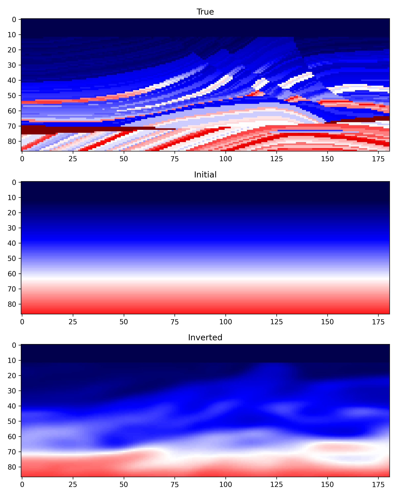

# FWI plus Neural network

In this topic, we will show several examples of how to combine the neural network (NLP, CNN, etc.) into the FWI framework.

## [Implicit neural network (Model reparameterization) with NLP](https://doi.org/10.1029/2022JB025964)

We discrete the models of subsurface into grids with either finite-difference or finite-element methods. In fact, we can use a neural network to replace it, then the inversion can be regarded as optimizing the weights of the neural network. Here, we implement this by using Sun's idea: Use a neural network that takes coordinates as input and outputs the corresponding model parameters to replace the original gridded discrete model.

The implicit NN method has been fully incorporated into the seistorch. A parameter named `implicit` in cofingure file is used to turn on/off the implicit network. This example is at `examples/implicitNN`

- **Generate acquisition system and modeling**
    In this example, we use a downsampled marmousi model with 4.6km*1.6km, since we need to trail and error several times for getting a good learning rate.

    ```shell
    python show_shotgather.py
    sh forward.sh
    ```

    The acqusition system is shown as follows:
    

- **Pretrain**

    We use 1D gradient model to pretrain the siren. After pretraining, the information of the models is saved in a neural network, by inputing the cooradinates to the network, we can obtain the cooresponding model parameters.

    ```shell
    python pretrain.py
    ```


- **Run inversion with implicit NN**

    The configure file of implicit NN is at `examples/implicitNN/config/implicit.yml`. By setting the `pretrained` path of implicit neural network, seistorch will load the weights from file. If you want to start from a random velocity model, just leave the `pretrained` blank.

    In this example, we start inversion with data in 5~8Hz.

    ```shell
    sh fwi_implicit_pretrain.sh 
    ```

    

    The inverted result can be seen as above. We can see that the implicit NN inverted model is highly smoothed, just as Sun said *low-frequency information are always learned first compared to high-frequency information*. So, this method may be served as a tool to generate a start model for traditional FWI.


