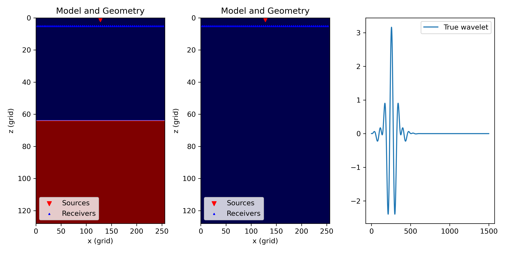
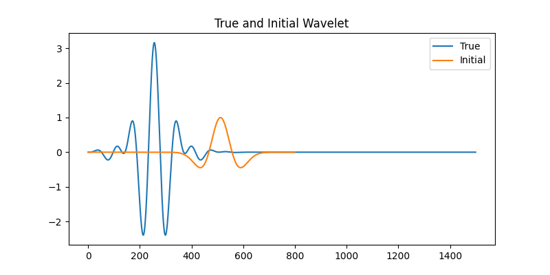
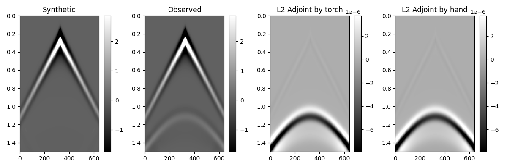

# Source inversion
The code of this section locates at `examples/source_inversion`. This exmaples shows a workflow of performing source inversion based on pure automatic differentiation (PAD).

We first generate a two layer velocity model and a background velocity. A BSpline wavelet (Cao and Han, 2011) is used as the source for modeling the observed data. Running the following commands will generate the corresponding velocity models, geometry and wavelet for forward modeling.

```shell
python generate_model_geometry.py
```

The generated ground truth model and background model can be seen in the following figure. The wide band Bspline shown in the third column is used as the wavelet for modeling observed data.



Run the script `sh forward.sh` will generate the observed data.

```shell
sh forward.sh
```

The objective function in source inversion is the same as in Full Waveform Inversion (FWI), which aims to match observed data with synthetic data. However, the difference lies in FWI, where we set the model parameters as the optimization targets, while in source inversion, the source wavelet serves as the parameter to be optimized.

The script `source_inversion.py` provides a workflow of source inversion. A ricker wavelet is used as the initial source for optmization.



```shell
python source_inversion.py
```

The intermediate steps of the inversion process will be saved in the `results` folder.

The following figure shows the final inverted result. We can observe that while the maximum and minimum amplitudes may not be consistent, the phase of the waveform has been relatively well recovered.


# How to calculate the adjoint source in torch?

The adjoint source is essentially the derivative of the objective function with respect to the synthetic seismic records. Therefore, to calculate the adjoint source, you only need to construct different loss functions and use `torch.autograd.grad` to build the computation graph for differentiation, i.e. `adj=torch.autograd.grad(loss(syn, obs), syn)`. 

If we use the l2 loss function (waveform amplitude loss), the adjoint is the element difference of the synthetic and observed data, i.e. `adj=2*(syn-obs)/syn.numel()`. More details can be seen from the source code `examples/cal_adjoint_source`.

While this process is implicit within automatic differentiation frameworks, you can use this approach to verify whether the adjoint sources are behaving as expected when you need to check their behavior. It provides a way to inspect and validate the correctness of the adjoint sources during the inversion process.

- **Model setup**

    1. Generate the acquisition geometry and velocity models.
    ```shell
    python generate_model_geometry.py
    ```

    2. Perform forward modeling to generate the observed data.
    ```shell
    sh forward.sh
    ```
    

- **Using sesitroch to perform forward modeling**

    The script `cal_adjoint.py` shows a workflow of calculating the adjoint source by seistorch. In this script, we demonstrate the consistency between using PyTorch APIs and manually calculating the adjoint sources. The results indicate that they are consistent. 
    You can obtain the results by running the following script, and the results match the figure shown below.

    ```sh
    python cal_adjoint.py
    ```

    
