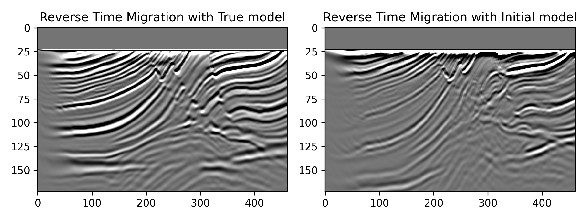

# Reverse time migration

This example locates at `examples/rtm/marmousi`, we use a towed acqusition system with marmousi model to perform rtm.

- **Generate geometry and observed data**

    Change to the example folder:
    ```shell
    cd examples/rtm/marmousi
    ```

    Perform forward modeling:
    ```shell
    sh forward.sh
    ```
    

- **Remove first arrivals**

    Generate the data mask to remove the first arrivals.

    ```shell
    python generate_datamask.py
    ```
    

- **Perform RTM**

    Set the loss in `.sh` file to `rtm`, and set `epoch` in `.yml` file to `1` to perform one fwi iteration for calculating the gradient.

    Run rtm with true model.
    ```shell
    sh rtm_truemodel.sh
    ```

    Run rtm with initial model.
    ```shell
    sh rtm_initmodel.sh
    ```

- **Get the migration results**
    Show the gradietns and migration results.

    ```shell
    python show results.py
    ```
    The automatic differention calculated gradients by backpropagating the observed data are shown as follows:
    

    The laplace filtered migration sections are shown below:
    

    If you want to obtain a common image gather, you need to set `--num-batches` to the number of shots `nshots` to get the gradient of each shot. The following figures show the common image gather migrated by a smoothed model and a linear model:
    