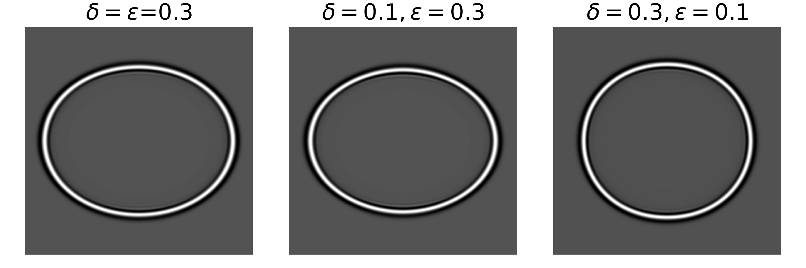

# qP-wave modeling (VTI case)
This example demonstrates how to model qP-wave using seistorch.

# Theory
We follow [Liang et al. (2023)](https://doi.org/10.1190/GEO2022-0292.1)'s equations of qP-wave modeling, which is given by:

$$
\frac{\partial^2 P}{\partial t^2}=V_{\mathrm{P} 0}^2\left[(1+2 \varepsilon)+S_k\right] \frac{\partial^2 P}{\partial x^2}+V_{\mathrm{P} 0}^2\left(1+S_k\right) \frac{\partial^2 P}{\partial z^2}
$$

where $P$ is the qP-wave, $V_{\mathrm{P} 0}$ is the P-wave velocity, and $S_k$ can be calculated by:

$$
S_k=\frac{-2(\varepsilon-\delta) k_x^2 k_z^2}{(1+2 \varepsilon) k_x^4+k_z^4+2(1+\delta) k_x^2 k_z^2}
$$

where $k_x$ and $k_z$ are the wavenumbers in the $x$ and $z$ directions, respectively, and $\varepsilon$ and $\delta$ are the Thomsen parameters.

# Examples

We provide 3 easy models, which are the same as the examples in [Liang et al. (2023)](https://doi.org/10.1190/GEO2022-0292.1)'s paper *Table 1*. 
|Model| $\delta$ | $\epsilon$  | $v_p$ | 
| :--------: |:--------: | :-----: | :-----: |
|A| 0.3 | 0.3 | 2500 |
|B| 0.1 | 0.3 | 2500 |
|C| 0.3 | 0.1 | 2500 |

A ricker wavelet with a dominant frequency of 20 Hz is used as the source wavelet. The source wavelet is located at the center of the model. The horizontal and vertical grids are 301 and 301 with a grid spacing of 10 m. The P-wave velocity is 3000 m/s.

The simulated wavefields are shown below:

There's no degenerate qSV wavefield by this acoustic approximation.
