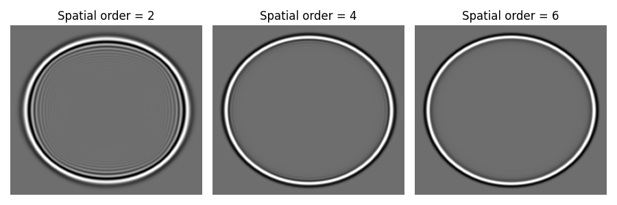

# The influence of spatial order on the forward modeling

In this example, we demonstrate the influence of the spatial order on the forward modeling. We consider a 2D homogeneous model. The script `generate_model.py` is used to generate the model.

The following figures show the snapshots of the forward modeling for different spatial orders.

We can see that the spatial order has a significant influence on the forward modeling. The higher the spatial order, the lower the numerical dispersion.