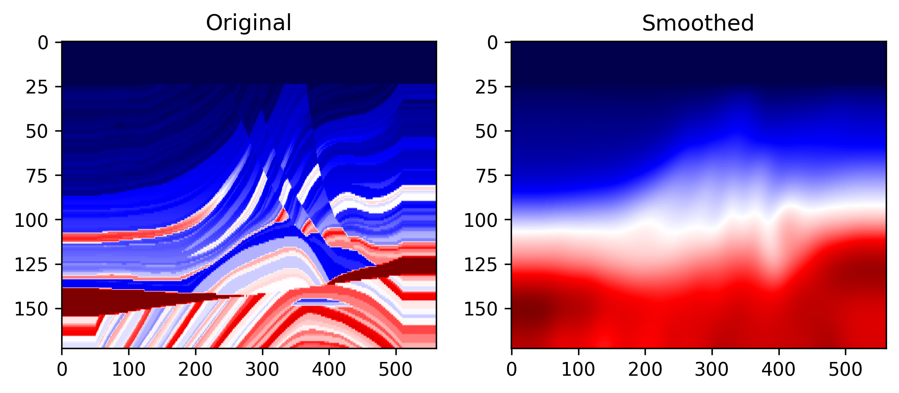
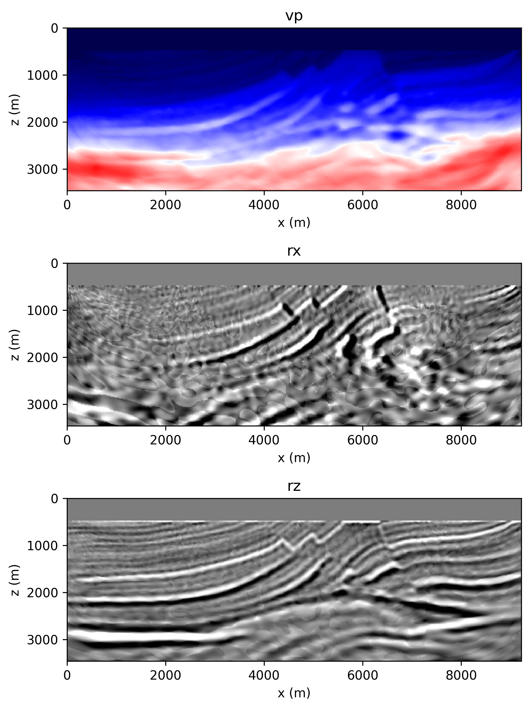
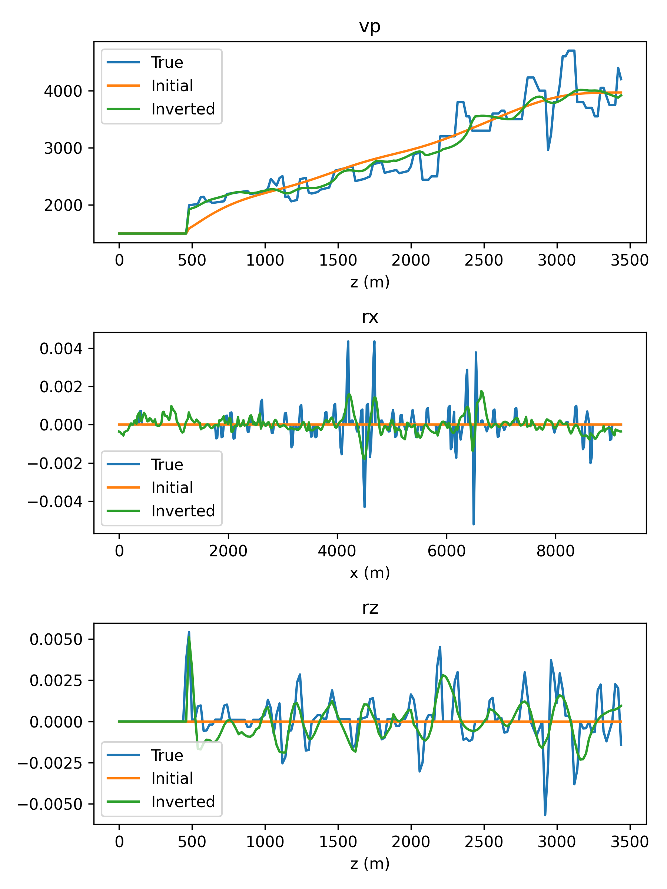

# Joint FWI and LSRTM
This example demonstrates how to use seistorch perform joint Full Waveform Inversion (FWI) and Least Squares Reverse Time Migration (LSRTM) on Marmousi model.

# Workflow
Generate the geometry files for inversion.
```sh
python generate_model_geometry.py
```
Simulate the observed data.
```sh
sh forward.sh
```
Perform the joint inversion using the source encoding strategy.
```sh
sh sefwi.sh
```
Plot the inverted velocity model and reflectivity model.
```sh
python show_results.py
```

# Theory
The joint FWI and LSRTM is based on a wave equations that incorporates a vector reflectivity model. The wave equation is given by:
$$
\frac{\partial^2 p}{\partial t^2}-\left(v^2 \nabla^2 p+v \nabla v \cdot \nabla p-2 v^2 \mathbf{R} \cdot \nabla p\right)=S
$$
where $p$ is the pressure wavefield, $v$ is the velocity model, $\mathbf{R}=(r_x, r_z)$ is the vector reflectivity model, and $S$ is the source term.

The joint inversion problem is formulated as:
$$
\min_{v, \mathbf{R}} \left\{ \sum_{s,r}^{} \left\| \mathbf{d}_i - \mathbf{F}_i(v, \mathbf{R}) \right\|_2^2 \right\}
$$
where $\mathbf{d}_i$ is the observed data, $\mathbf{F}_i(v, \mathbf{R})$ is the forward modeling operator.

# Inversion
For joint FWI and LSRTM in 2D case, there are 3 parameters to be inverted: velocity model, $v$, and vector reflectivity model, $\mathbf{R}=(r_x, r_z)$. The ground truth reflectivity model is calculated by the following formula:
$$\mathbf {R}=\frac{1}{2} \frac{\nabla z}{z}=-\frac{1}{2}z\nabla \frac{1}{z}$$
where $z$ is acoustic impedance, which is calculated by the product of velocity and density, i.e., $z=\rho v$.

A geometry of 93 sources and 461 receivers is used here for inversion. The geometry files of the inversion can be generated by the following commands:
```sh
python generate_model_geometry.py
```
The generated ground truth velocity model and initial velocity model are shown in the following figure:


Then simulate the observed data using the following commands:

```sh
sh forward.sh
```

The script `sefwi.sh` is used to perform the joint inversion with a source encoding strategy. The inversion parameters can be found [here](configs/inversion.yml) and [here](sefwi.sh). 

Finally, perform the joint inversion using the following commands:
```sh
sh sefwi.sh
```

The inverted velocity models and reflectivity models are shown in the following figure:


A vertical profile comparison of the inverted velocity model and reflectivity model with the ground truth is shown in the following figure:


There still has room for improvement in the inversion results. The inversion results can be improved by multi-scale inversion and hyperparameter tuning.

# References
[Whitmore et al., Full Wavefield Modeling with Vector Reflectivity, 2020, EAGE.](https://doi.org/10.3997/2214-4609.202010332)

[Wu et al., Joint Full Waveform Inversion and Least Squares Reverse Time Migration, 2024, IEEE TGRS.](https://doi.org/10.1109/TGRS.2024.3349608)