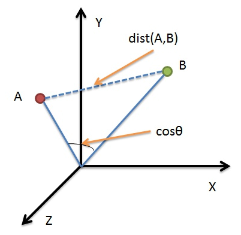
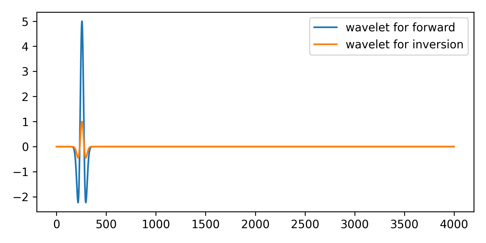
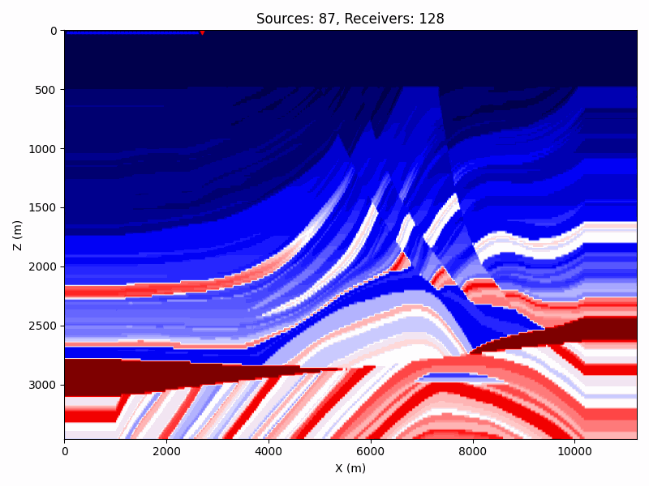
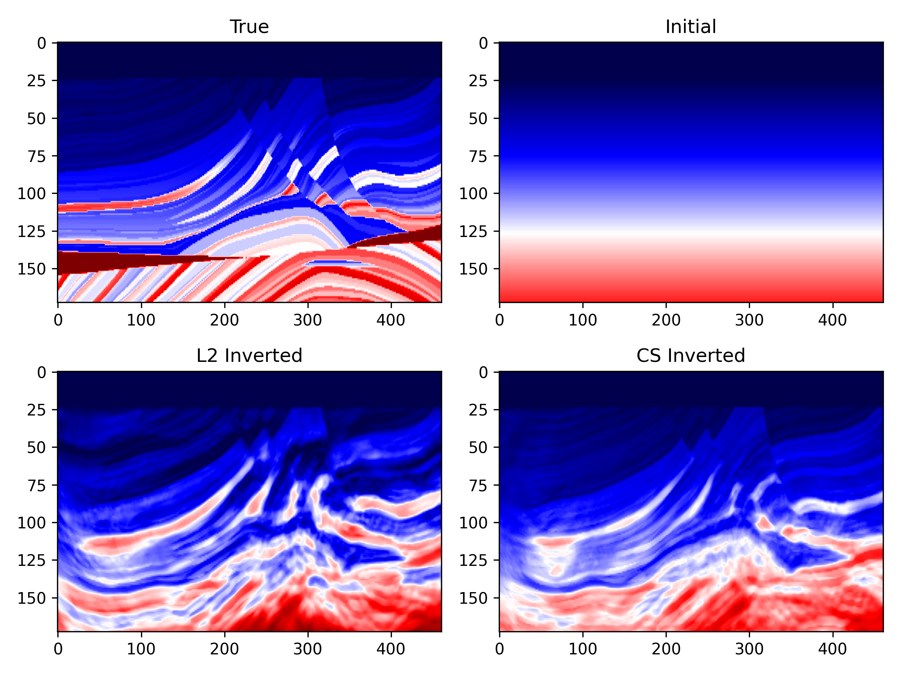
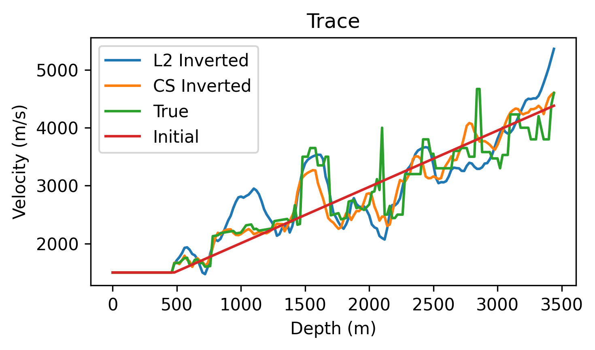

# Cosine similarity misfit
This example demonstrates the comparison of two inverted models using different misfits. The misfit used in this example is the cosine similarity misfit and L2 misfit.
# Workflow
Step 1: Generate the Wavelet and geometry.
```bash
python generate_model_geometry.py
```
Step 2: Simulate the observed data.
 ```bash
sh forward.sh
```
Step 3: Invert the Marmousi model using cosine similarity misfit.
```bash
sh inversion_cs.sh

```
Step 4: Invert the Marmousi model using L2 misfit.
 ```bash
sh inversion_l2.sh
```
Step 5: Plot the inverted models and vertical profiles of the inverted models.
 ```bash
python show_results.py
```
# Theory
The cosine similarity misfit, or the so called normalized cross correlation and global correlation norm, actually measures the similarity between two vectors. The cosine angle between observed trace data $\mathbf{d}_{obs}$ and synthetic trace data $\mathbf{d}_{syn}$ is calculated as follows:
$$\begin{equation}
{cos(\theta)} = \frac{\mathbf{d}_{obs} \cdot \mathbf{d}_{syn}}{\|\mathbf{d}_{obs}\| \|\mathbf{d}_{syn}\|}
\end{equation}$$
The value ranges from -1 to 1, where 1 indicates that the two signals are identical, -1 indicates that the two signals are opposite, and 0 indicates that the two signals are orthogonal.

Just like the following figure shows, no matter how the amplitude of the two signals (A & B) changes, the cosine similarity between them remains the same.



Since we want to minimize the misfit, we can use the following equation to calculate the loss:
$$\begin{equation}
J(\mathbf m) = \sum_{s,r} 1 - cos(\theta)
\end{equation}$$

# Example

In this example, we use L2 misfit and cosine similarity misfit to invert the Marmousi model. A 10Hz ricker wavelet, whose maximum amplitude is 5, is used as the source wavelet for simulating the observed. For inversion, the amplitude of the source wavelet is set to 1.

For generating wavelets and geometry, please kindly run the script `generate_model_geometry.py`. The two wavelets are shown in the following figure.


A towed streamer with 87 sources and 128 receivers per source is used in this example. The source-receiver geometry is shown in the following figure.


Then you can run the following command to simulate the observed data:
```bash
sh forward.sh
```

The scripts `inversion_cs.sh` and `inversion_l2.sh` are used to invert the Marmousi model using cosine similarity misfit and L2 misfit, respectively. You can run the following command to start the inversion:
```bash
sh inversion_cs.sh
sh inversion_l2.sh
```
Note that only one GPU is used in this example. If you have multiple GPUs, you can modify the `nproc_per_node` parameter in the `sh` file to enable them.

The inverted models and vertical profiles of the inverted models are shown in the following figures.



From the figures, we can see that the inverted model using cosine similarity misfit is more resonable than the one using L2 misfit. The vertical profiles of the inverted models are also more consistent with the true model, especially in the shallow part.


