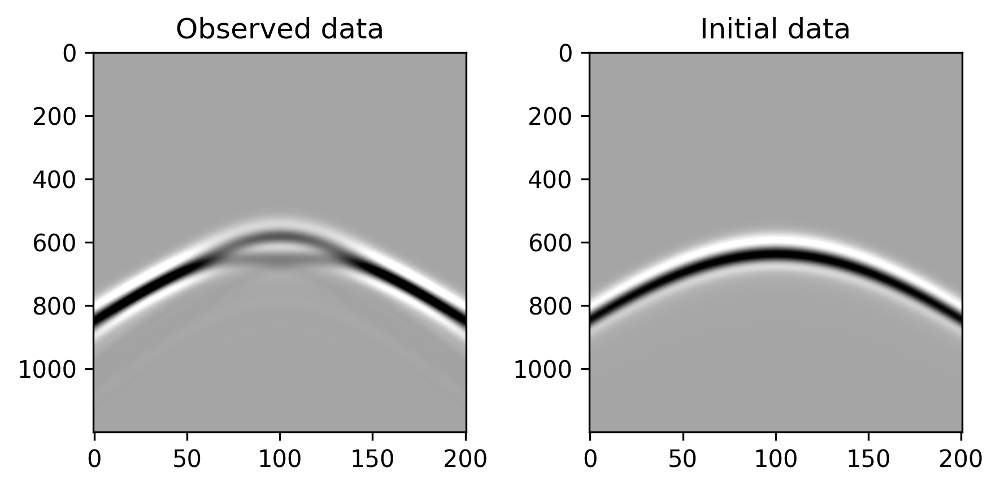
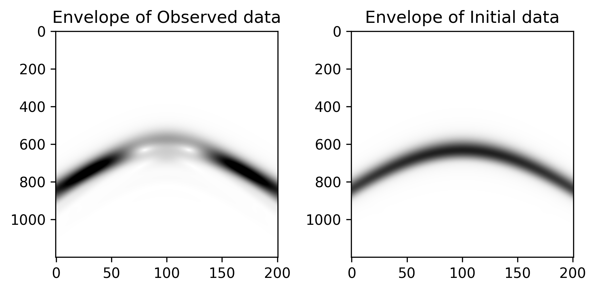
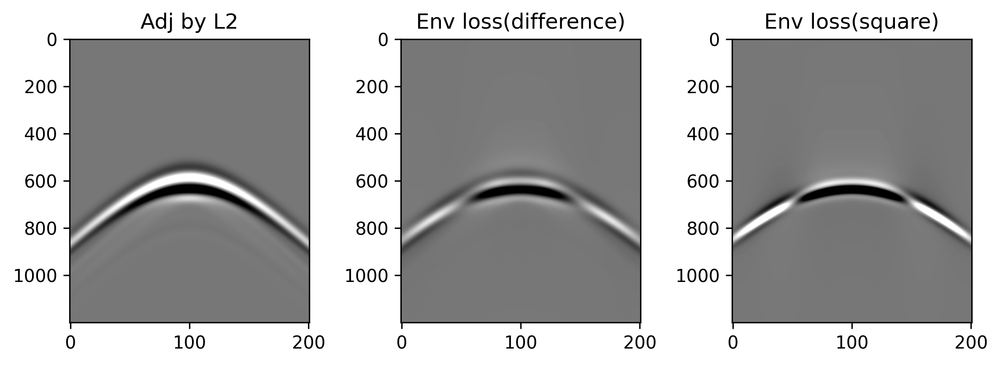

# Envelope Misfit
This example will reimplement the envelope-based loss function used in paper [Full waveform inversion method using envelope objective function without low frequency data, Chi et al(2014)](http://dx.doi.org/10.1016/j.jappgeo.2014.07.010). The envelope-based loss function is used to mitigate the cycle skipping problem in full waveform inversion.

# Workflow for reproducing
```python
# 0. See how envelope works
python envelope_of_ricker.py
# 1.Generate the model and geometry
python generate_model_geometry.py
# 2a.Simulate the synthetic data with initial model
sh initial.sh
# 2b.Simulate the observed data with true model
sh observed.sh
# 3. show the intermediate results
python cal_adj.py
# 4. Run inversion script for calcuating the first gradient
sh fwi_l2.sh
sh fwi_envelope.sh
# 5. Draw the gradients
python show_gradient.py
```

# Example with Ricker wave
The torch version `hilbert` and `envelope` function can be found in `seistorch/transforms.py`. The envelope-based loss function can be found in `seistorch/loss.py`.

Assume we have a 10Hz Ricker wavelet with 1Hz sampling rate and 1s duration. The envelope of the wavelet and the original signal are shown below.


The frequency spectrum of the original signal and the envelope are shown below.


We can see that the envelope has a lower frequency than the original signal.

If we apply a highpass filter to the original signal, the low-frequency information will be removed. The filtered and original signals are shown below.


Do envelope transform to the filtered signal, we can see that the envelope still has the low-frequency information (See eq. 10&11 of the original paper for mathematical explanations), which is shown below.


# Example with a anomaly model

Here we use a simple anomaly model to demonstrate the envelope-based loss function. The anomaly model and corresponding seismic geometry are shown below.(You can use the script `generate_model_geometry.py` for generating the model and geometry.). The radius of the anomaly is 150m, and the velocity of the anomaly is 3000m/s. The velocity of the background is 2000m/s. The initial velocity model has a constant velocity of 2000m/s as the background model.

The sources (red upside-downtriangle) are located at the surface of the model, and the receivers (green solid circles) are located at the bottom boundary of the model.


We first simulate the seismic data with the anomaly model and the background model. The simulated observed (left) and synthetic (right) data are shown below.



The envelope of the observed (left) and synthetic (right) data are shown below.



An extracted trace of the observed and synthetic data is shown below. Which verifies the correctness of the envelope calculation.


Here we implemented two envelope-based loss functions. One is the squared difference of the two envelopes $J(\mathbf{m})=\frac{1}{2} \sum_{s, r} \int_0^T\left[E^2_{obs}-E_{syn}^2\right]^2 dt$, another one is the difference of the two envelopes $J(\mathbf{m})=\frac{1}{2} \sum_{s, r} \int_0^T\left[E_{obs}-E_{syn}\right]^2 dt$. 

The adjoint source calculated by taking the derivative of the loss function with respect to the synthetic data using automatic differentiation is shown below. They can also be calculated by using the mathematical formula in the original paper.



From the frequency spectrum of the adjoint source shown below, we can see that the envelope-based adjoint source (the red and green line) has a lower frequency than the original element-wise difference source (the blue one).


The gradient of L2 loss and envelope-based loss are shown below. For inversion, we only use the data higher that 5Hz. The boundary of the circle are drawn as red.


The following figure shows the gradient profile at depth 500m. 


