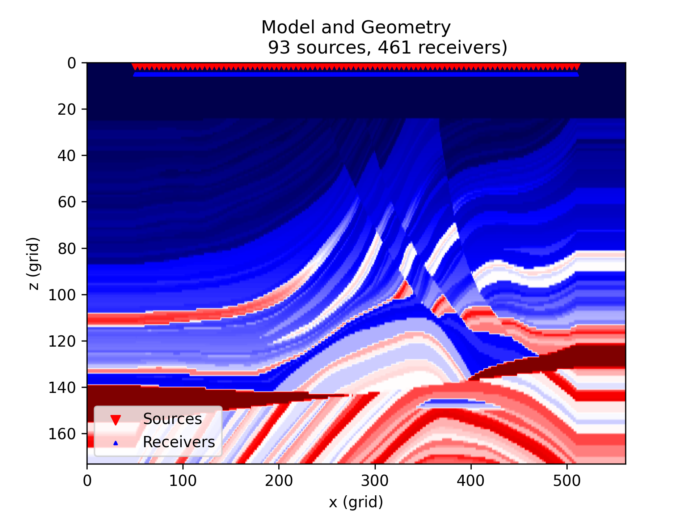
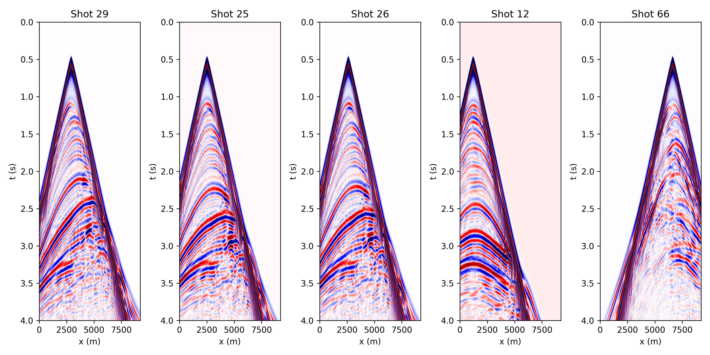
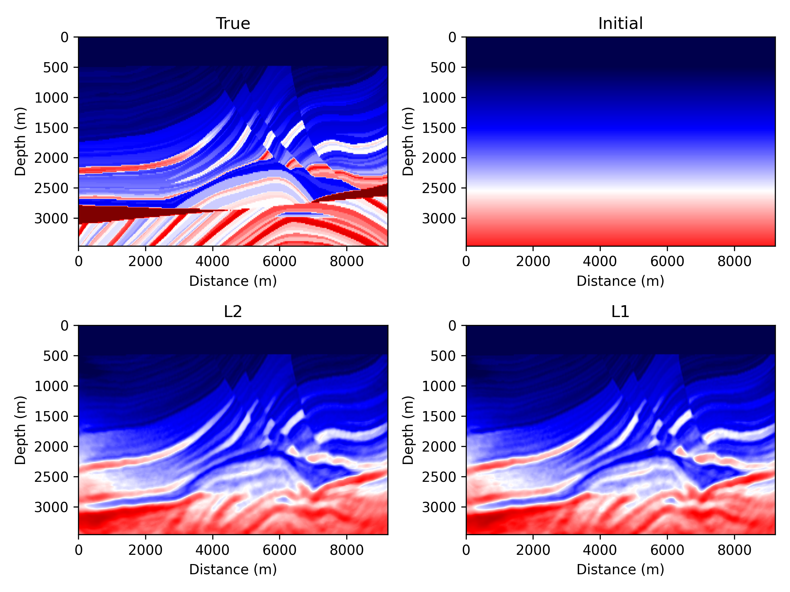
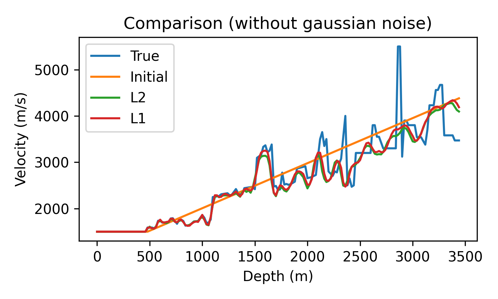
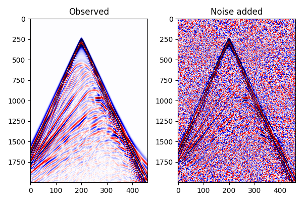
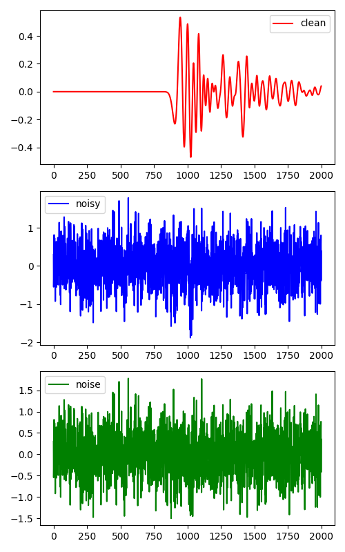
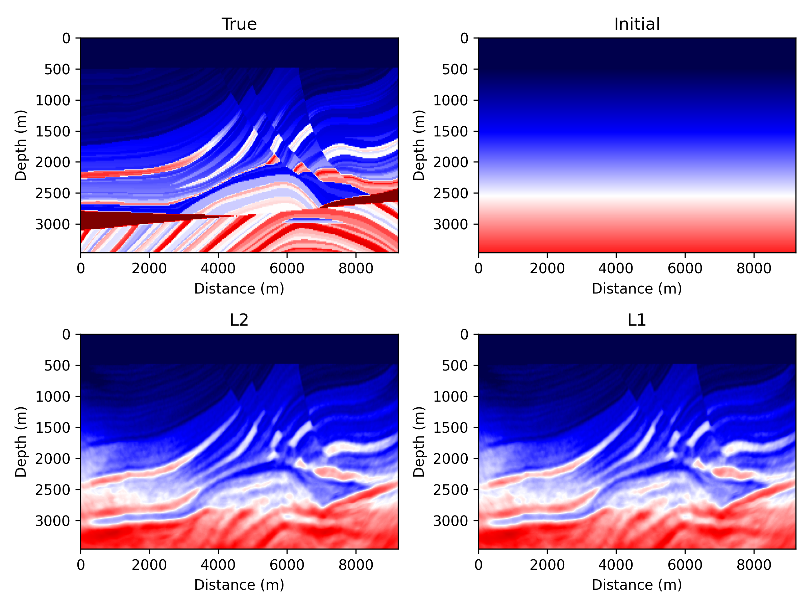
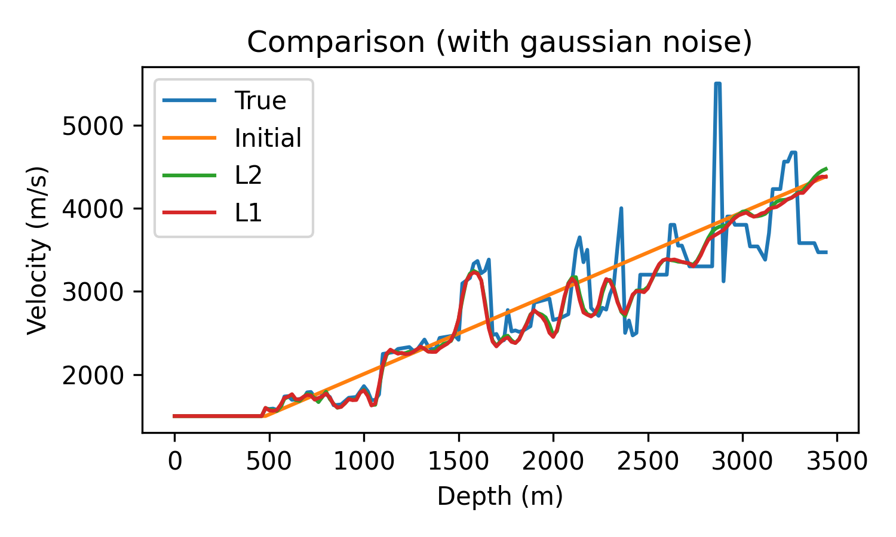

# L1 misfit v.s. L2 misfit
This example compares the L1 and L2 misfits based on the Marmousi model and **acoustic** wave equation, source encoding is used for inversion. In all inversion test, we assume that the source wavelet is known and the source wavelet is the same for all shots. The comparison is only based on the misfit functions and noise types.

# Data generation
We first generate the observed data using the Marmousi model and the acoustic wave equation.

Run python script `generate_model_geometry.py` for generating the geometry files. A fixed reiver geometry is used in this example.

The script `forward.sh` is used for generating the observed data. The clean observed data will be save as `observed.npy` in the directory `data`. Beside, run script `show_shotgather.py` to show the shotgathers of the observed data.

# Inversion with clean data

We first perform inversion with clean data with L1 and L2 misfits. The script `sefwi_l1.sh` and `sefwi_l2.sh` are used for L1 and L2 misfits respectively. The inveretd results will be save in the folder `results/l1` and `results/l2`.

The comparison of the inverted velocity models is shown below.

The vertical profile at x=4km is shown below.

There is no significant difference between the inverted velocity models with L1 and L2 misfits.

# Inversion with gaussian blurred data

We then add gaussian noise to the observed data. The script `add_gaussiannoise.py` is used for adding gaussian noise to the observed data. The noise has normal distribution with mean 0 and standard deviation 0.5.

The original observed data and the data with gaussian noise are shown below.

A trace comparison is shown below.

We then perform inversion with the noisy data with L1 and L2 misfits. The script `sefwi_l1_gaussian.sh` and `sefwi_l2_gaussian.sh` are used for L1 and L2 misfits respectively. The inveretd results will be save in the folder `results/l1_gaussian` and `results/l2_gaussian`.

The comparison of the inverted velocity models is shown below.

Trace comparison is shown below.

There still no significant difference between the inverted velocity models with L1 and L2 misfits. For comparison more clearly, the results with/without noise are drawn together (Since the results with L1 and L2 misfits are similar, only the results with L1 misfit are shown).

_noise_l1.png)

Compared with the results with clean data, the shallow part of the inverted velocity models are coincident with each other, but the deep structures are not well recovered with the noisy data.
