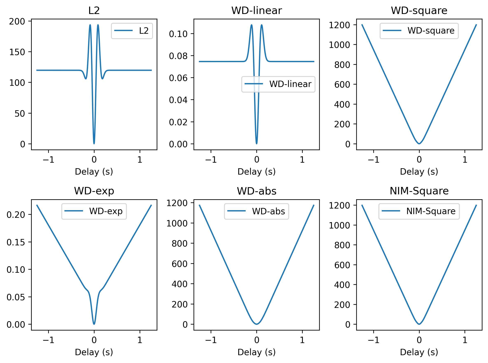
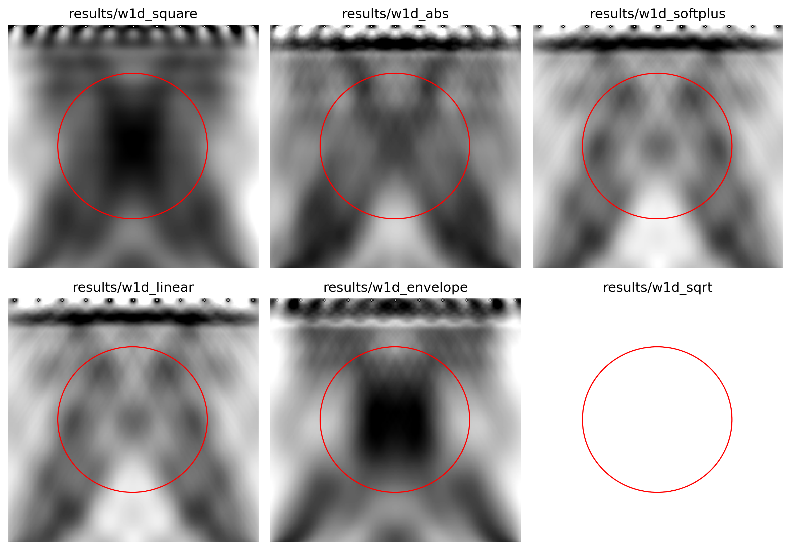

# wasserstein 1d distance
This example will reimplement the wasserstein distance in 1d. Assume $X(t)$ and $X(t)$ are CDFs(Culmulative Distribution Function) of two signals $x(t)$ and $y(t)$, the wasserstein distance is defined as

$$
W_1(x,y) = \int_R |X(t) - Y(t)| dt
$$

The p-Wasserstein distance is defined as

$$
W_p(x,y) = \left( \int_R |X^{-1}(q) - Y^{-1}(q)|^p dq \right)^{1/p}
$$

where $X^{-1}(q)$ is the inverse of $X(t)$, and $q$ is the quantile funtcions (inverse CDFs). The aforementioned definition is a special case of the p-Wasserstein distance with $p=1$.

So the question is how to convert seismic signals to CDFs. For calculating the CDF, a typical way is to convert the data to non-negative values and norm them by the summation, and then apply integration to get the CDF. (I think a better way is to calculate the PDF first, and then integrate the PDF to get the CDF. But I have not implemented the differentiable PDF calculation yet.)

The misfit between a ricker signal and a shifted ricker signal by different loss functions are shown below(You can use `ricker.py` to reproduce the figure):

I also compared the effect of normalization on the misfit based on a anomaly model. The results are shown below:

# References
1. [Analysis of optimal transport and related misfit functions in full-waveform inversion](https://doi.org/10.1190/GEO2017-0264.1)

2. [Estimating the Background Velocity Model with the Normalized Integration Method](https://doi.org/10.3997/2214-4609.20130411)

3. [FWIGAN: Full-Waveform Inversion via a Physics-Informed Generative Adversarial Network](https://doi.org/10.1029/2022JB025493)