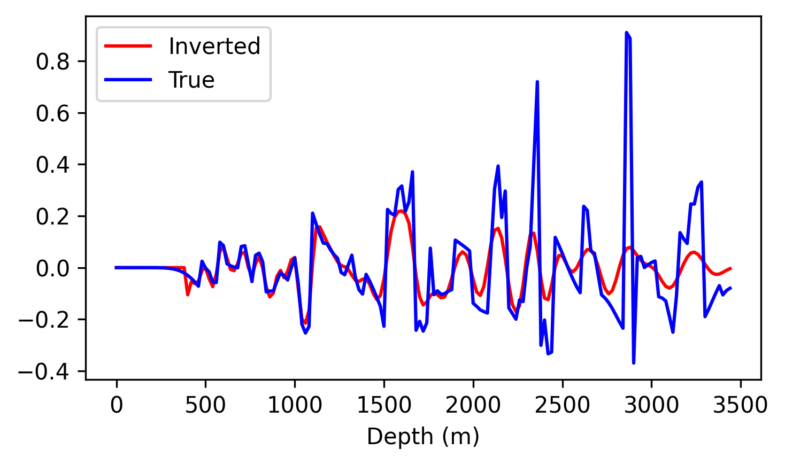

# Acoustic Least-Squares Reverse Time Migration (LSRTM)
This example demonstrates how to perform acoustic least-squares reverse time migration (LSRTM) using Seistorch. LSRTM is an iterative imaging method that aims to improve the quality of the migration image by iteratively updating the reflectivity model. The reflectivity model is updated by minimizing the misfit between the observed and modeled born data.
# Theory
The acoustic LSRTM objective function is given by:
$$

    J(\mathbf{m}) = \frac{1}{2} \sum_{i=1}^{N} \left\| \mathbf{d}^{obs}_i - \mathbf{d}^{syn}_i \right\|^2_2,
$$
where $\mathbf{m}$ is the reflectivity model, $\mathbf{d}^{obs}_i$ is the observed data at the $i$-th shot, $\mathbf{d}^{syn}_i$ is the modeled data at the $i$-th shot, and $N$ is the number of shots.

For the scalar acoustic wave equation, the forward modeling is given by:
$$
\frac{1}{v_0^2(\mathbf{x})} \frac{\partial^2 P_0}{\partial t^2}=\nabla^2 P_0 .
$$
where background velocity $v_0(\mathbf{x})$ is known and $P_0$ is the corresponding background wavefield. Perturbate the velocity model as $\Delta v(\mathbf{x})$ and the reflectivity model, $v(\mathbf x)=v_0(\mathbf x)+\Delta v(\mathbf x)$, the perturbed wavefield $P=P_0+\Delta P$ satisfies the following equation:
$$
\frac{1}{v^2(\mathbf{x})} \frac{\partial^2 P}{\partial t^2}=\nabla^2 P
$$
Taking the difference between the above two equations, we have:
$$
\frac{1}{v_0^2(\mathbf{x})} \frac{\partial^2 \Delta P}{\partial t^2}=\nabla^2 \Delta P+\frac{\partial^2 P}{\partial t^2} \frac{2 \Delta v(\mathbf{x})}{v_0^3(\mathbf{x})}
$$
where the $\Delta P$ is named as the scattering wavefield, according to the born approximation, i.e. $P \approx P_0$, and define the reflectivity as $m(\mathbf{x})=\frac{2 \Delta v(\mathbf{x})}{v_0(\mathbf{x})}$, we have:
$$
\frac{1}{v_0^2(\mathbf{x})} \frac{\partial^2 \Delta P}{\partial t^2}=\nabla^2 \Delta P+\frac{m(\mathbf{x})}{v_0^2(\mathbf{x})} \frac{\partial^2 P_0}{\partial t^2}
$$

So, for calcuating the scattering wavefield $\Delta P$, we need first calculate the background wavefield $P_0$, then take $P_0$ as the source term to solve the scattering wavefield $\Delta P$.

# Example

We use Marmousi model for testing the LSRTM. First, we generate the geometry and velocity model by running the `generate_model_geometry_fixed.py`. Then we generate the observed data by solving the acoustic wave equation, the needed configure parameters and shell script are in the `forward_obs.yml` and `forward_obs.sh`.

The background velocity model is smoothed from the ground truth Marmousi model, and the reflectivity model is generated with zeros. The smoothed background velocity model and the geometry are shown in the following figure.


When doing LSRTM, the velocity model is fixed and the reflectivity model is updated iteratively. The Adam optimizer with a learning rate of 0.01 is used to minimize the objective function. The reflectivity model after 50 iterations is shown in the following figure.


The comparison of the inverted reflectivity model and the true reflectivity model is shown in the following figure.




# Usage
```bash
# 1. Generate the geometry and velocity model
python generate_model_geometry_fixed.py
# 2a. Simulate the observed data
sh forward_obs.sh
# 2b. Simulate the direct wave
sh forward_direct.sh
# 3. Remove the direct from observed data
python move_direct.py
# 4. Run LSRTM
sh traditional.sh
# or
sh traditional_adam.sh
# 5. Show the result
python show_results.py
```