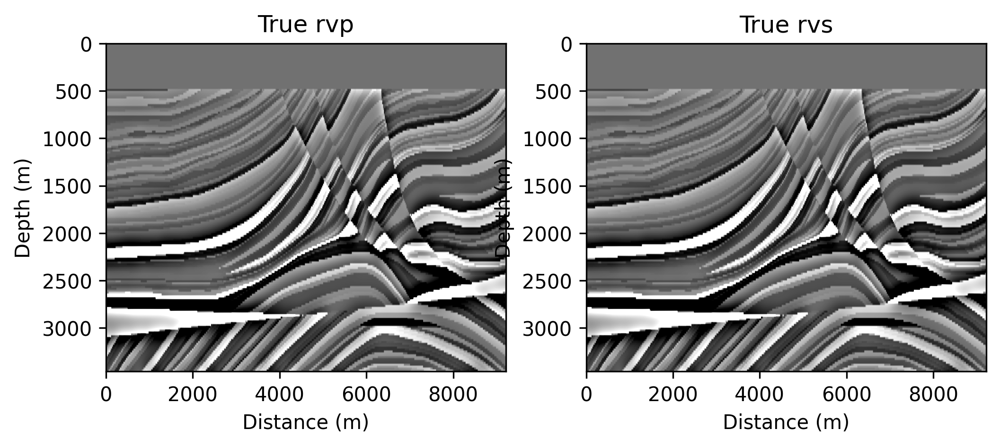
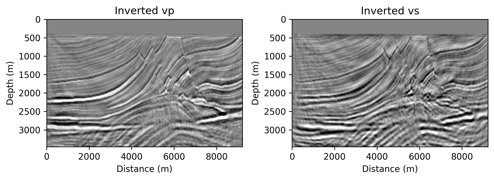
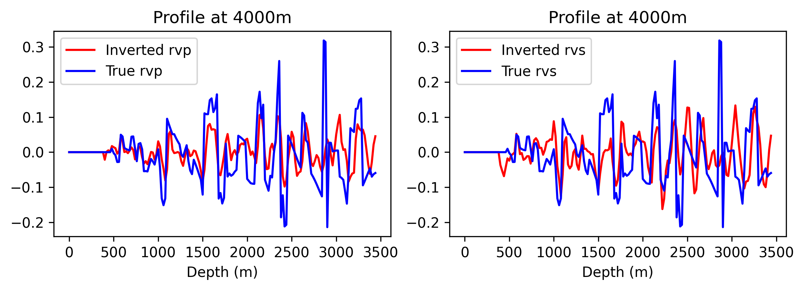

# Elastic Least Squares RTM

# Example

The background velocity model is smoothed from the true velocity model with a gaussian filter of sigma=5. The true reflectivity model is shown below.



The inverted reflectivity $v_p$ and $v_s$ model are shown below.



The comparison of the inverted reflectivity model and the true reflectivity model are shown below.




# Usage
```bash
# 1. Generate geometry
python generate_model_geometry_fixed.py
# 2. Generate observed data
sh forward_obs.sh
# 3. Run elastic LSRTM
sh lsrtm.sh
# 4. Plot results
python show_results.py
```