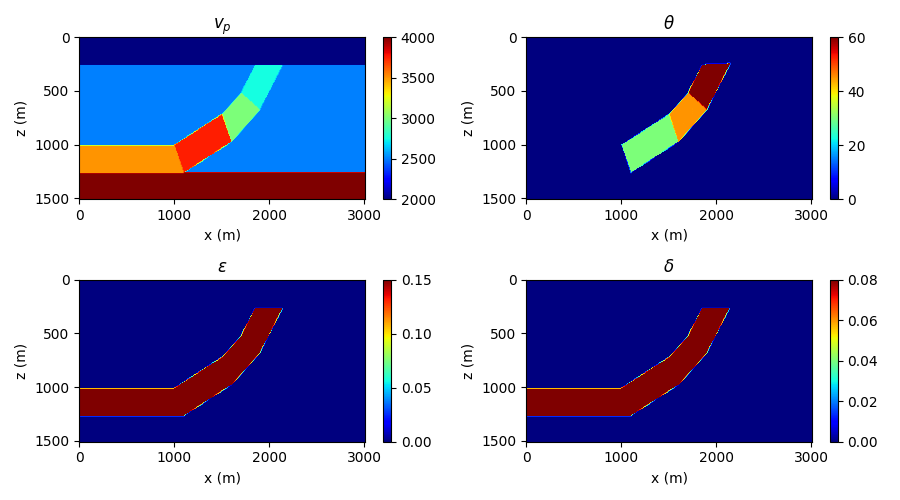
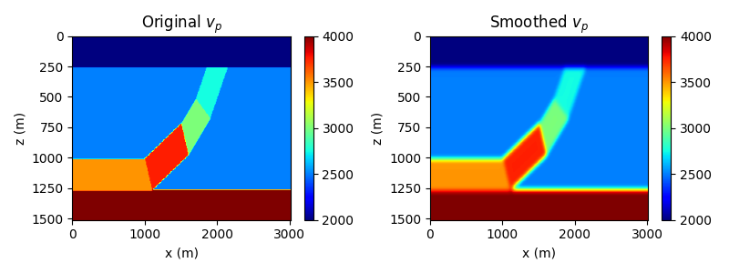
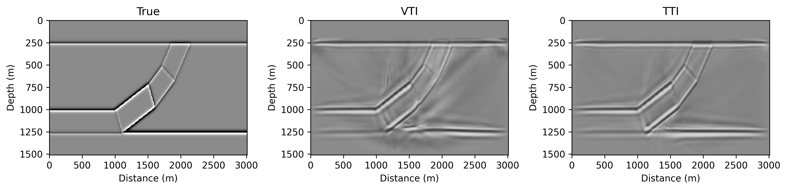
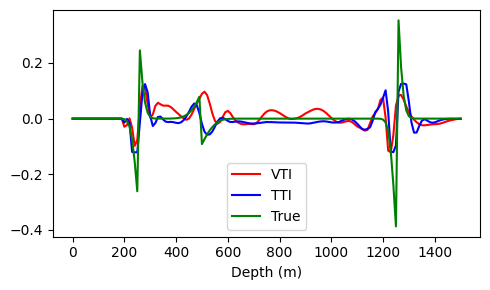

# Pure qP-wave equation-based VTI and TTI LSRTM
This example demonstrates how to perform qP-wave equation-based VTI and TTI least-squares reverse time migration (LSRTM) using Seistorch.

# Theory

## VTI case
The VTI qP-wave equation follows [Liang et al., 2023](https://doi.org/10.1190/GEO2022-0292.1) (eq. 12 and eq.14), which reads:

$$
\frac{\partial^2 P_0}{\partial t^2}=V_{\mathrm{P} 0}^2\left[(1+2 \varepsilon)+S_k\right] \frac{\partial^2 P_0}{\partial x^2}+V_{\mathrm{P} 0}^2\left(1+S_k\right) \frac{\partial^2 P_0}{\partial z^2}
$$

where $P_0$ is the backgroud wavefield, $V_{\mathrm{P} 0}$ is the background P-wave velocity, and $S_k$ can be calculated by:

$$
S_k=\frac{-2(\varepsilon-\delta) k_x^2 k_z^2}{(1+2 \varepsilon) k_x^4+k_z^4+2(1+\delta) k_x^2 k_z^2}
$$

where $k_x$ and $k_z$ are the wavenumbers in the $x$ and $z$ directions, respectively, and $\varepsilon$ and $\delta$ are the Thomsen parameters.

By substituting the background velocity with the perturbation, and disgarding the perturbation of the Thomsen parameters, we can easily derive the qP-wave born modeling equation in VTI case:

$$
\frac{1}{V_{\mathrm{P} 0}^2}\frac{\partial^2 P_s}{\partial t^2}=\left[(1+2 \varepsilon)+S_k\right] \frac{\partial^2 P_s}{\partial x^2}+\left(1+S_k\right) \frac{\partial^2 P_s}{\partial z^2}+ m \frac{1}{V_{\mathrm{P} 0}^2} \frac{\partial P_0}{\partial t^2}
$$

where $P_s$ is the scattered wavefield, and $m$ is the perturbation of the velocity, which can be calculated by:

$$
m=\frac{2V_{P_s}}{V_{P0}}
$$

where $V_{P_s}$ is the perturbation of the P-wave velocity, the ground truth velocity model is the sum of the background velocity and the perturbation, i.e., $V_{P}=V_{P0}+V_{P_s}$.

## TTI case
The TTI qP-wave equation follows [Liang et al., 2023](https://doi.org/10.1190/GEO2022-0292.1) (eq. A-5 and eq.A-7), which reads:

$$
\begin{aligned}
& \frac{1}{V_{\mathrm{P} 0}^2}\frac{\partial^2 P_0}{\partial t^2}=\left[(1+2 \varepsilon) \cos ^2 \theta^0+\sin ^2 \theta^0+S_k\right] \frac{\partial^2 P_0}{\partial x^2} \\
& +\left[(1+2 \varepsilon) \sin ^2 \theta^0+\cos ^2 \theta^0+S_k\right] \frac{\partial^2 P_0}{\partial z^2} \\
& -2 \varepsilon  \sin \left(2 \theta^0\right) \frac{\partial^2 P_0}{\partial x \partial z}
\end{aligned}
$$

where $\theta^0$ is the tilt angle, and $S_k$ can be calculated by:

$$
\begin{aligned}
&\begin{aligned}
& S_k=-2(\varepsilon-\delta)\left(k_x \cos \theta^0-k_z \sin \theta^0\right)^2\left(k_x \sin \theta^0+k_z \cos \theta^0\right)^2 \frac{1}{\text { Deno }} \\
& \text { Deno }=(1+2 \varepsilon)\left(k_x \cos \theta^0-k_z \sin \theta^0\right)^4+\left(k_x \sin \theta^0+k_z \cos \theta^0\right)^4 \\
& +2(1+\delta)\left(k_x \cos \theta^0-k_z \sin \theta^0\right)^2\left(k_x \sin \theta^0+k_z \cos \theta^0\right)^2
\end{aligned}
\end{aligned}
$$

Similar to the VTI case, by substituting the background velocity with the perturbation, and disgarding the perturbation of the Thomsen parameters, we can easily derive the qP-wave born modeling equation in TTI case:

$$
\begin{aligned}
& \frac{1}{V_{\mathrm{P} 0}^2}\frac{\partial^2 P_s}{\partial t^2}=\left[(1+2 \varepsilon) \cos ^2 \theta^0+\sin ^2 \theta^0+S_k\right] \frac{\partial^2 P_s}{\partial x^2} \\
& +\left[(1+2 \varepsilon) \sin ^2 \theta^0+\cos ^2 \theta^0+S_k\right] \frac{\partial^2 P_s}{\partial z^2} \\
& -2 \varepsilon  \sin \left(2 \theta^0\right) \frac{\partial^2 P_s}{\partial x \partial z} + m \frac{1}{V_{\mathrm{P} 0}^2} \frac{\partial P_0}{\partial t^2}
\end{aligned}
$$

# Examples

We use a aniosotropic model like that in [Mu et al., 2020](https://doi.org/10.1190/GEO2019-0320.1) to test the qP-wave equation-based VTI and TTI LSRTM. The model is shown in the following figure:



A smoothed version of the velocity model is used for LSRTM, which is shown in the following figure:



Then we perform VTI LSRTM and TTI LSRTM, respectively. The aniso parameters are fixed to ground truth values, and the velocity model is the smoothed version shown above.

Note: The observed data is generated by the TTI born modeling, i.e. the ground-truth observed data that need to be fitted, instead of the TTI qP-wave equation.

Both VTI and TTI LSRTM are performed with 30 iterations, using a congugate gradient optimizer with a initial learning rate of 0.01. The ground-truth and inverted reflectivity models are shown in the following figures:



The TTI LSRTM has a better performance than the VTI LSRTM. For comparison, we extract the reflectivity at the horizontal slice at 2.0 km, and the comparison is shown in the following figure:



# Usage
```bash
# 1. Generate the models
python generate_model.py
# 2. Generate the geometry
python generate_geometry.py
# 3. Modeling the born data
sh tti_forward_born.sh
# 4. Perform VTI & TTI LSRTM
sh vti_lsrtm.sh && sh tti_lsrtm.sh
# 5. Plot the results
python compare_vti_tti.py
```