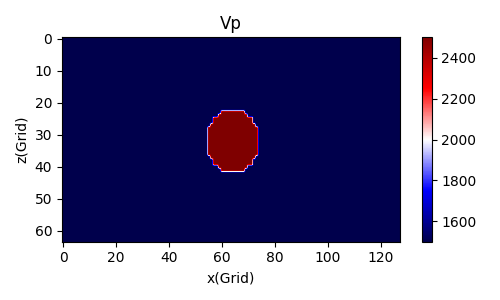
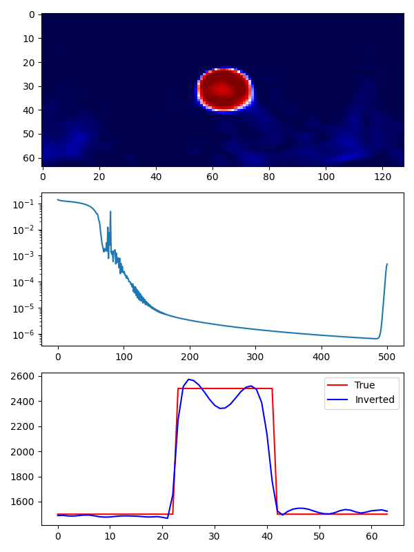

# Neural Network for Model Representation
This example demonstrates how to use a neural network to represent the model parameters in FWI. The neural network is trained to represent the parameters, such as the density and Lamé parameters, in the elastic wave equation. The models are then input to the elastic wave equation to simulate the wave propagation. The neural network is optimized by minimizing the misfit between the observed and predicted data.

# Theory
Wave equations are mainly solved by finite-difference(FDM) or finite-element(FEM) methods. These methods require a discretized model, i.e. grid-based model. For example, in FDM, the grid-based model $c$ in 2D case can be represented as

$$
\mathbf c = 
\begin{bmatrix}
c_{11} & c_{12} & \cdots & c_{1n} \\
c_{21} & c_{22} & \cdots & c_{2n} \\
\vdots & \vdots & \ddots & \vdots \\
c_{m1} & c_{m2} & \cdots & c_{mn}
\end{bmatrix}
$$

where $c_{ij}$ is the model parameter at the $i$-th row and $j$-th column. The wave equation is then solved on this grid-based model.

Actually, we can use a neural network to represent these model parameters, which is called the **model representation**. For example, we can map coordinates $(x,y,z)$ to the model parameters $(c_{11},c_{12},c_{13})$ by a neural network. The model representation can be written as

$$
\mathbf c = F(x,y,z; \theta)
$$

where $F$ is the neural network, $(x,y,z)$ are the spatial coordinates, and $\theta$ are the parameters of the neural network. 

**NOTE**: The input of the neural network can also be replaced by other elements, such as the **frequency**, **azimuth**, **well data**, **migration image**, **shot data**([Dhara & Sen, 2023](https://doi.org/10.1109/TGRS.2023.3294427), [Jiang et al., 2022](https://doi.org/10.1111/1365-2478.13292)), **fixed vectors**([Zhu et al., 2019](https://doi.org/10.1190/GEO2020-0933.1), [He & Wang, 2021](https://doi.org/10.1190/geo2019-0382.1), [Wu & McMechan](https://doi.org/10.1190/GEO2018-0224.1)) etc, in addition to the **spatial coordinates**([Zhu et al., 2019](https://doi.org/10.1190/GEO2020-0933.1), [Sun et al., 2023](https://doi.org/10.1029/2022JB025964)). In general, Image-like data is more suitable for CNN-based networks, spatial coordinates are more sutible for MLP-based networks.

For conventional FWI, the objective function is defined as:

$$
J(\mathbf m) = \frac{1}{2} \sum_{s,r}^{} \left\| d_{\text{obs}}^i - d_{\text{syn}}(\mathbf m)^i \right\|^2
$$

where $\mathbf m$ is the model parameter, $d_{\text{obs}}$ is the observed data, and $d_{\text{syn}}$ is the synthetic data. The synthetic data is calculated by solving the wave equation on the grid-based model.

And for model representation FWI, the objective function is defined as:

$$
J(\theta) = \frac{1}{2} \sum_{s,r}^{} \left\| d_{\text{obs}}^i - d_{\text{syn}}(F(\mathbf x;\theta))^i \right\|^2
$$

where $F$ is the neural network, $\mathbf x$ is the input of the network, and $\theta$ are the parameters of the neural network. The solver needed parameters can be calculated by input $\mathbf x$ to the neural network $F$.

**Note on priori info.:** There are several approaches for incorporating the priori information into this method. For example, we can **pre-train the network with the priori information**([Wu & McMechan, 2019](https://doi.org/10.1190/GEO2018-0224.1), [He & Wang, 2021](https://doi.org/10.1190/GEO2019-0382.1), [Jiang et al., 2022](https://doi.org/10.1111/1365-2478.13292)), or we can use the output of the neural network as a **update over the initial model** ([Dhara A.&Sen M., 2023](https://doi.org/10.1109/TGRS.2023.3294427), [Zhu et al., 2022](https://doi.org/10.1190/GEO2020-0933.1)), or we can build the connection explicitly (by governing equations)/implicitly (by another network) between different parameters.

# About examples

In example 1, 2 and 3, the input of the network is the **spatial coordinates**, and the output are wave-equation needed model parameters.

# Example 1: 2D acoustic case
In this example, we use a simple anomaly model to demonstrate the model representation FWI. The model is shown in the following figure:



Ten sources with 128 fixed receivers are at the surface of the model. The shot gathers are shown in the following figure:


The neural network is randomly initialized, so the inversion is actuallly start from a random model. With 500 epochs, the inversion result is shown in the following figure:



It can be seen that the inverted model is very close to the true one. The vertical slices comparison also confirms the accuracy of the inversion result.

For reproducibility, the following is the command to run the example (you'd better run it in an interactive window because there are some figures to show):
```bash
# Change to the example directory
cd implicit_acoustic
# generate the ground truth model
python generate_model.py
# simulate and save the observed data
python forward.py
# train the neural network
python ifwi.py
```
# Example 2: 2D elastic case ($v_p$ and $v_s$)
In this case, we will investigate the model representation FWI for decoupling Lamé parameters. The designed vp and vs models are shown in the following figure:


Both designed vp and vs model has as a circle anomaly, the difference is the center of the circle. The $\rho$ has a constant value of 2000 $kg/m^3$. Only $v_z$ is recorded for inversion. Besides, the sources and receiver are at the surface of the model.

## Example 2, case 1: Single network for two parameters
The neural network is randomly initialized as the previous example. We use a single network to represent two parameters. The true-value of $v_p$ and $v_s$ can be obtained by denormalizing the output of the neural network with a standard and mean value.

$$
v_p, v_s = F(\mathbf x;\theta) * std + mean
$$

The inverted models after 4000 epochs are shown in the following figure:


There is no significant artifacts in the inverted models, especially the crosstalks between vp and vs. But the boundary of the $v_p$ anomaly is not very sharp as the $v_s$ model.

**Note**: For reproducibility, the following is the command to run the example (you'd better run it in an interactive window because there are some figures to show):
```bash
# 1. Generate the ground truth model
python generate_model.py
# 2. Simulate and save the observed data
python forward.py
# 3. Train the neural network
python ifwi.py
```

# Example 2, case 2: Two networks for two parameters
In this case, we use two networks to represent two parameters. The first network is used to represent $v_p$ and the second network is used to represent $v_s$. Both networks have the same number of layers and neurons.

$$
v_p = F^1(\mathbf x;\theta_1)*std_{v_p} + mean_{v_p}
$$
$$
v_s = F^2(\mathbf x;\theta_2)*std_{v_s} + mean_{v_s}
$$

The configure file and inversion script can be found in `configure2.py` and `ifwi2.py`.

The inverted models after 1000 epochs are shown in the following figure:


Compare to the single network case, the inverted models are more accurate and the boundary of the $v_p$ anomaly is sharper.

The extracted vertical slices from x=32(in grid) in $v_p$ and  x=96(in grid) $v_s$ models are shown in the following figure:


**Note**: For reproducibility, the following is the command to run the example (you'd better run it in an interactive window because there are some figures to show):
```bash
# 0. Change to the example directory
cd implicit_elastic
# 1. Generate the ground truth model
python generate_model.py
# 2. Simulate and save the observed data
python forward.py
# 3. Train the neural network
python ifwi2.py
```

# Example 3: 2D elastic case ($v_p$, $v_s$ and $\rho$)
In this case, we design a model with three parameters, $v_p$, $v_s$ and $\rho$. The parameters are linked by the elastic wave equation. The designed models are shown in the following figure:


The inversion is similar to the previous case, but we need to use three networks to represent three parameters. All the networks have the same number of layers and neurons. The configure file and inversion codes can be found in `implicit_elastic3/configure.py` and `implicit_elastic3/ifwi3.py`. The grid-based model can be decoded by the following equations:

$$
v_p = F^1(\mathbf x;\theta_1)*std_{v_p} + mean_{v_p}
$$
$$
v_s = F^2(\mathbf x;\theta_2)*std_{v_s} + mean_{v_s}
$$
$$
\rho = F^3(\mathbf x;\theta_3)*std_{\rho} + mean_{\rho}
$$

The inverted models after 2000 epochs are shown in the following figure:


The inverted $v_p$ and $v_s$ models are very close to the true ones. The $\rho$ model has some artifacts, especially in the anomaly area.

You can reproduce the results by running the following commands:
```bash
# 0. Change to the example directory
cd implicit_elastic3
# 1. Generate the ground truth model
python generate_model.py
# 2. Simulate and save the observed data
python forward.py
# 3. Train the neural network
python ifwi3.py
```

# Existed methods

[1] Wu & McMechan, Parametric convolutional neural network-domain full-waveform inversion, 2019, Geophysics ([paper link](https://doi.org/10.1190/GEO2018-0224.1))

[2] He Q.L. & Wang Y.F., Reparameterized full-waveform inversion using deep neural networks, 2021, Geophysics ([paper link](https://doi.org/10.1190/GEO2019-0382.1))

[3] Zhu W.Q., Xu K.L., Darve E., et al., Integrating deep neural networks with full-waveform inversion: Reparameterization, regularization, and uncertainty quantification, 2022, Geophysics ([paper link](https://doi.org/10.1190/GEO2020-0933.1))

[4] Jiang P., Wang Q.Y., Ren Y.X., et al., Full waveform inversion based on inversion network reparameterized velocity, 2022, Geophysical Prospecting ([paper link](https://doi.org/10.1111/1365-2478.13292))

[5] Dhara A. & Sen M. K., Elastic Full Waveform Inversion using a Physics guided deep convolutional encoder-decoder, 2023, IEEE TGRS ([paper link](https://doi.org./10.1109/TGRS.2023.3294427))

[6] Sun J., Innanen K., Zhang T.Z., et al., Implicit Seismic Full Waveform Inversion With Deep Neural Representation, 2023, JGR Solid Earth ([paper link](https://doi.org/10.1029/2022JB025964))