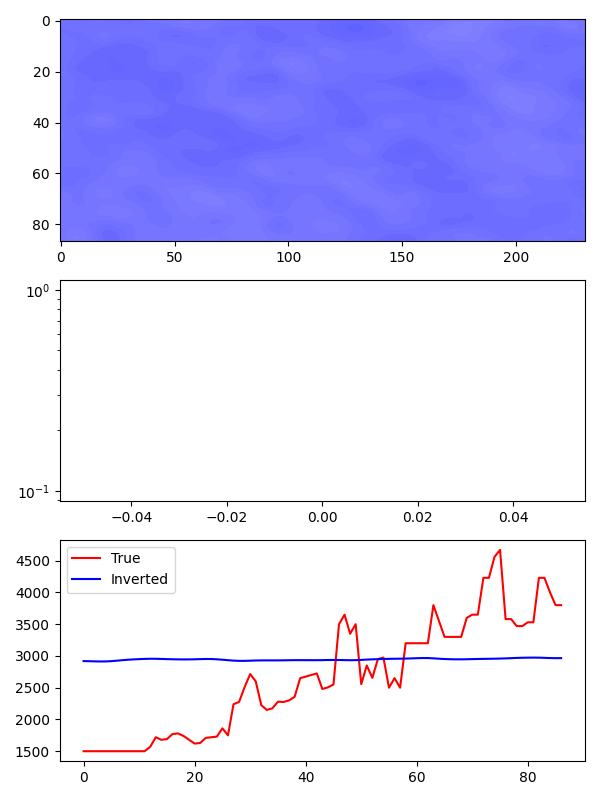
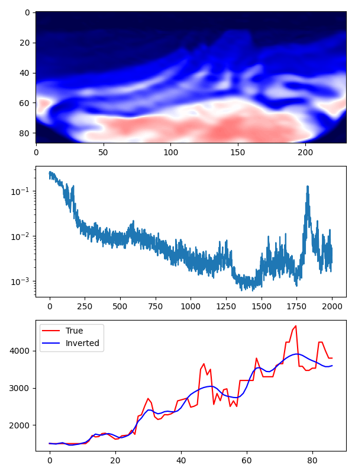

# Neural representations for FWI

In this case, a downsampled marmousi model is used to investigate how powerful the neural representations are for FWI. The model is downsampled by a factor of 2 in both directions. The model is 87x231 in grids, with a grid spacing of 20m. 

A Siren neural network is used to represent the model. The neural network is a 5-layer fully connected network with 256 neurons in each layer. The activation function is the sine function. The acoustic wave equation is the link between the model space and data space.

The initial model is randomly filled with values around 3000m/s, because the weights of the network is generated randomly. The initial model looks like the following figure:



The inverted model after 2000 epoch can be seen in the following figure:



*Note*: The inversion process will last ~30 min on a RTX 3080 Ti.

# Usage

```bash
# 1. Generate the model
python generate_model.py
# 2. Simulate the data
python forward.py
# 3. Invert the model
python ifwi.py
```