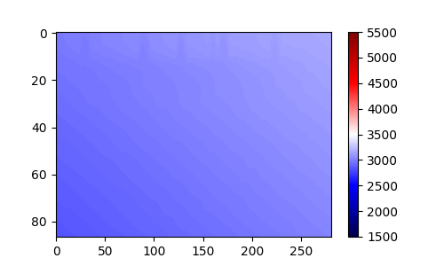
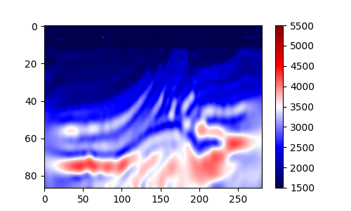

# Neural representation for Acoustic FWI

In this example, a jax-based code is provided to solve the FWI problem for the Marmousi model. A Siren neural network is used to represent the velocity model. The implementation is same as the one provided in the [Implicit Acoustic FWI example](examples/nn_embedded_fwi/model_representation/implicit_acoustic_marmousi) but with the difference that the whole code is written in JAX, which provides 5x speedup compared to the torch-based implementation.

# Usage
Just run the script `ifwi_jax.py`, the inverted results will be saved in the `figures` folder.

# Results
The inverted velocity model at the 0th iteration is shown below:

Since the neural network is initialized with random weights, the inverted model at the 0th iteration is just a random noise with a mean vale of `mean_vp` and a standard deviation of `std_vp`.

The inverted velocity model at the 3000th iteration is shown below:

It has a much better resolution compared to the 0th iteration after 3000 iterations of FWI.

*Note*: The torch-based and jax-based implementations are not exactly the same, so the inverted results may not be exactly the same.