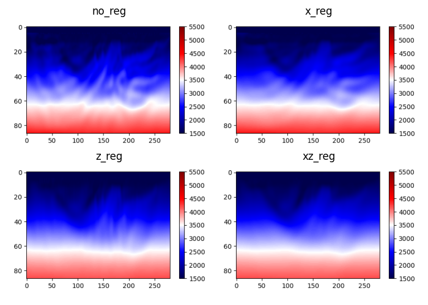

# Regularization-based FWI
This example demonstrates how to use the regularization in FWI method based on automatic differentiation.

# Theory

The conventional misfit function for FWI is defined as

$$
J(m) = || \mathbf d_{obs} -\mathbf d_{syn}(m) ||^2
$$

where $\mathbf d_{obs}$ is the observed data, $\mathbf d_{syn}$ is the synthetic data, and $m$ is the model parameter.

A regularization term can be added to the misfit function to stabilize the inversion process, which is defined as

$$
J(m) = \lambda_1|| \mathbf d_{obs} -\mathbf d_{syn}(m) ||^2 + \lambda_2|| \mathbf L m ||^2
$$

where $\lambda_1$ and $\lambda_2$ are the weights of the data misfit and regularization term, respectively, and $\mathbf L$ is the regularization operator.

# Example

Here we use a simple first-directional derivative operator to build the regularization term. The regularization operator is defined as

$$
\mathbf L = \nabla_x m + \nabla_z m
$$

where $\nabla_x$ and $\nabla_z$ are the first directional derivative operators in the x and z directions, respectively.

The first-order derivative operator can be interpreted as a smoothing operator, to keep the gradient of the inverted model in both the x and z directions close to zero, that is, to keep the model smooth.

The inverted model is shown in the following figure.

The subfigure with title `no_reg` is the inverted model without regularization, and the subfigure with title `x_reg`(`z_reg`) is the ones with regularization in only x(z) direction, and the subfigure with title `xz_reg` is the one with regularization in both x and z directions.

With regularization in both x and z directions, the inverted model is smoother than the one without regularization. Perform regularization in z direction, the inverted model is only smooth in the z direction, and vice versa.

# Usage

You can reproduce the figures in the paper with the script `fwi.py`. A function named as `regularization_model(vp, x=True, z=True)` is defined in the script to perform regularization. You can change the regularization direction by setting the parameter `x` or `z` in the function. Please refer to the script for more details.