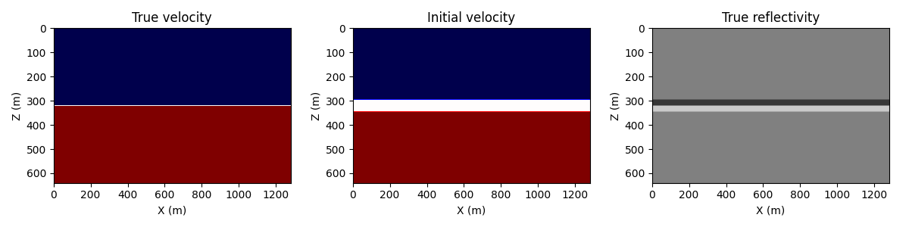

# Regularization-based FWI
This example shows the effect of regularization on the inverted model in LSRTM.

# Theory

Similar to FWI, the objective of LSRTM is also to minimize the misfit between the observed and synthetic data, but the difference is that the data is simulated by born modeling in LSRTM. The misfit function is defined as

$$
J(m) = || \mathbf d_{obs} -\mathbf d_{syn}(m) ||^2
$$

where $\mathbf d_{obs}$ is the observed data, $\mathbf d_{syn}$ is the synthetic data, and $m$ is the model parameter.

In Lin & Huang's paper, they use a modified total-variation regularization term to preserve sharp interfaces in the high-frequency-band data FWI. And for LSRTM, we also want the interfaces to be sharp, so we need to reconsider the regularization term in the objective function. A general form of regularization-based misfit is defined as(EQ. 9 in [Lin & Huang's paper](https:doi.org/10.1093/gji/ggu393))

$$
J(m) = \lambda_1|| \mathbf d_{obs} -\mathbf d_{syn}(m) ||^2 + \lambda_2 \sqrt{|| \nabla m ||^2}
$$

where $\lambda_1$ and $\lambda_2$ are the weights of the data misfit and regularization term, respectively, and $\nabla$ is first-order derivative operator in all spatial directions.

# Example

For testing the effect of the above mentioned regularization term, we use a simple model with a horizontal interface. The model is shown in the following figure.



The ground-truth model has two layers, the velocity of upper and lower layers are 1.5 km/s and 2.0 km/s, respectively. The model used for LSRTM has a thin layer with a velocity of 1.75 km/s between the two layers, with a thickness of 10 grids. So, the reflectivity will have two opposite staircases at the top and bottom of the thin layer.

The inverted model without regularization is shown in the following figure.


The inverted model with regularization is shown in the following figure.


We can see that the inverted model with regularization has a sharper interface and less noise than that without regularization.

# Usage
```bash
# 1. Generate the true model
python generate_model.py
# 2. Generate the observed data
python forward.py
# 3. Invert the model without/without regularization
python lsrtm.py
```

*Note*: For running LSRTM with regularization, you need to set the `use_reg` flag in `lsrtm.py` to `True`.

# Reference
- Lin & Huang, Acoustic- and elastic-waveform inversion using a modified total-variation regularization scheme, GJI, 2014 ([link](https:doi.org/10.1093/gji/ggu393))

